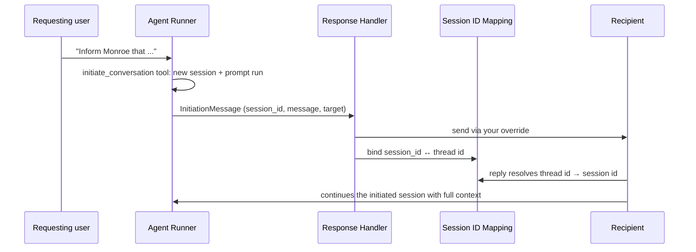

# Agent-Initiated Conversations

Agent Kernel agents can **proactively start a conversation** with a user on a connected messaging
platform (Slack, WhatsApp, Telegram, ...) — and the user's reply continues that same conversation
instead of starting a context-less one. The binding lives in a **Session ID Mapping** table that
associates the new session with the platform's thread identifier (`thread_ts` for Slack).

## Overview



The Agent Runner never learns which messaging platform is used: the recipient `target` is opaque,
and the platform send happens only in the Response Handler role.

## Enabling

Add the `mapping_table:` block — its presence enables the feature. The mapping store backend
**follows your `session.type`** (connection settings are reused from `session.<backend>`); the
block carries only namespace settings:

```yaml
session:
  type: redis
  redis:
    url: "redis://localhost:6379"

mapping_table:
  prefix: "ak:session-map:"        # Redis / Valkey key prefix
  table_name: ak-session-id-mapping # DynamoDB / Cosmos DB table (partition key 'map_key' (S))
  collection_name: ak-session-id-mapping # Firestore collection
  ttl: 0                            # seconds; 0 disables (not supported on Cosmos DB)
```

With the block present:

- the `initiate_conversation` system tool is registered on **all agents**;
- inbound platform messages resolve their thread id through the mapping before selecting a session;
- response handlers recognize initiation messages (`message_type=INITIATION` queue attribute).

## The `initiate_conversation` tool

`initiate_conversation(target, prompt, user_id="", agent="")`

The tool creates a fresh session, runs the owning agent (`agent` param, else the first registered)
with your `prompt`, and the reply becomes the outbound message — so the new session's history
already contains the exchange before the message is even sent. `user_id` (defaulting to `target`)
owns the conversation; with [thread support](threads.md) enabled, an AK thread is created for the
recipient, named by your configured naming strategy from the outbound text.

There is no fixed-text path: callers needing near-exact wording put it in the prompt
("send this message exactly as written: ..."); verbatim output is not guaranteed.

## Delivering the message

### Queue deployments (Lambda serverless / ECS containerized)

Initiation messages arrive on the **Output Queue** marked with the `message_type=INITIATION`
attribute. Stock response handlers log a warning and drop them — delivery belongs to your
`process_message` override (the same override that already delivers ordinary replies):

```python
from agentkernel.core.initiation import INITIATION_MESSAGE_TYPE, InitiationManager, InitiationMessage
from agentkernel.deployment.aws import ECSOutputConsumer
from agentkernel.deployment.aws.core.sqs_handler import SQSHandler


class MyOutputConsumer(ECSOutputConsumer):
    @classmethod
    def process_message(cls, record):
        attributes = SQSHandler.get_message_custom_attributes(record)
        if attributes.get("message_type") == INITIATION_MESSAGE_TYPE:
            initiation = InitiationMessage.model_validate_json(record["Body"])
            response = slack_client.chat_postMessage(channel=initiation.target, text=initiation.message)
            # Bind the mapping + initialize the AK thread — REQUIRED after a successful send
            InitiationManager.get().complete(initiation, response["ts"])
            return
        super().process_message(record)
```

Two rules to remember:

1. **Always call `InitiationManager.get().complete(initiation, thread_id)` after a successful
   send** — skipping it means replies can't resolve to the initiated session. `complete()` never
   raises, so calling it cannot redeliver the queue message (which would message the user twice).
2. When delivering an *ordinary* reply, look up
   `InitiationManager.get().get_messaging_integration_thread_id(session_id)` — a hit means the
   session was agent-initiated and the reply must be threaded under that platform thread id.

### Single-process REST deployments

Implement `InitiationSender` on one of your handlers — `RESTAPI.run()` detects it and wires the
in-process dispatcher, which sends and then binds automatically:

```python
class SlackInitiationHandler(AgentSlackRequestHandler, InitiationSender):
    def send_initiation_message(self, target, message, target_details=None) -> str:
        response = ...  # chat_postMessage
        return response["ts"]  # the messaging_integration_thread_id
```

See `examples/api/slack-initiation/` for a runnable example.

## Reply resolution

Every request-handler surface resolves inbound conversation ids through the mapping with an
identity fallback (unmapped ids behave exactly as before):

- all messaging integrations (Slack `thread_ts`; WhatsApp number, Telegram chat id, ...) — for Slack,
  a reply must be threaded to continue an initiated conversation: an un-threaded reply's own `ts`
  never matches a bound mapping, so it starts a new session rather than guessing which prior
  conversation it's answering;
- `POST /api/v1/chat` in queue deployments — note that a mapped `session_id` is **rewritten**, and
  the resolved id is returned in the response; poll with the returned `session_id`;
- override `resolve_session_id(messaging_integration_thread_id)` on any handler to customize the logic.

## Deployment notes

- **ECS containerized Terraform**: set `conversation_initiation = true` to create the
  `-session-id-mapping` DynamoDB table (hash key `map_key`, TTL attribute `expiry_time`) with IAM
  grants for the REST/IO service. The Agent Runner gets no grant — it never touches the table.
- A reply arriving in the instant between the platform send and the mapping bind resolves to a
  platform-derived session (accepted limitation); the initiated session's history is complete
  before the send, so subsequent replies have full context.
