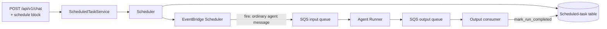

# Scheduled Tasks

Agent Kernel's **scheduled task capability** lets an agent run on a timer. A scheduled task is a
stored agent message plus the schedule that fires it. When it comes due, an external timer puts an
**ordinary agent message** on the existing input queue, and the agent runner executes it exactly as
it would any other queued request — there is no scheduled-run code path in the runner.

:::info Availability
Scheduling is deliberately narrow in this version:

- **AWS only.** Azure and GCP are not supported. A `Scheduler` ABC exists so other providers can be
  added later.
- **Queue-mode scalable deployments only** — AWS scalable serverless (Lambda) and AWS scalable
  containerized (ECS), both with `queue_mode = true`.

Non-queue deployments (single-Lambda serverless, plain REST container, local runs) do not get
scheduling in this version.
:::

## Overview



Key design points:

- **The timer's target is the input queue, not the agent.** A fire is indistinguishable from any
  other queued request, so it inherits the existing retries, DLQ, concurrency controls, guardrails,
  hooks and tracing.
- **A fire is an ordinary agent message.** There is no `ScheduledTaskRequest` or
  `ScheduledTaskResponse`. The existing request model gains one optional `scheduled_run` block,
  which the response echoes back verbatim.
- **No leader election, no distributed lock, no polling.** Nothing in Agent Kernel polls for due
  work, so replicas have nothing to race over. The timer is infrastructure — a scaled-to-zero
  Lambda deployment still fires.
- **Creation reuses the chat endpoint.** There is no new creation endpoint; `POST /api/v1/chat`
  accepts an optional `schedule` block. The `/api/v1/schedule` routes only query and manage
  already-created tasks.

### Terminology

| Term | Meaning |
|---|---|
| **Scheduled task** | The stored definition: an agent message plus the schedule that fires it. Identified by `scheduled_task_id`. |
| **Schedule** | The timing expression (cron / rate / one-time `at`) plus the conversation mode. A field of a scheduled task. |
| **Fire** | One delivery of a scheduled task's message onto the input queue by the timer. |
| **Run** | The agent execution that results from a fire. |

## Requirements

All of these are enforced, most of them at component initialization (process startup on ECS, cold
start on serverless):

| Requirement | Enforced by |
|---|---|
| AWS, queue mode (`queue_mode = true`) | Terraform — `scheduled_task = true` has a `validation` block rejecting `queue_mode = false` |
| FIFO input and output queues | Terraform — containerized hardcodes it, serverless defaults `fifo_queue` to `true` |
| A durable session store (`dynamodb`, `redis` or `valkey`) | `AKConfigError` at initialization — `in_memory` is rejected |
| `scheduler.group_name` and `scheduler.target_role_arn` set | `AKConfigError` at initialization — an empty string counts as unset |
| Exactly the location block matching `session.type` | `AKConfigError` at initialization — a populated block for a different backend is rejected, not ignored |
| An authenticated owner on every scheduled task | `AKConfigError` at initialization on the FastAPI surfaces; `401` per request on serverless REST |

## Configuration

Scheduling is switched on by the `scheduler` block. It holds **no scheduled-task definitions** —
tasks are only ever created at runtime by an authenticated caller — only the deployment wiring the
capability cannot derive:

```yaml
session:
  type: dynamodb              # dynamodb | redis | valkey — in_memory is rejected

scheduler:
  enabled: true
  agents: [assistant]         # agents the scheduling tools attach to; omit = all, [] = none
  group_name: ""              # EventBridge Scheduler group — injected by Terraform
  target_role_arn: ""         # IAM role the timer assumes — injected by Terraform
  region: us-east-1           # optional; defaults to the boto3 environment default
  dynamodb:
    table_name: ak-scheduled-tasks
```

| Field | Environment variable | Meaning |
|---|---|---|
| `enabled` | `AK_SCHEDULER__ENABLED` | Master switch, default `false`. When off, a `schedule` block on a chat request is rejected with `400` and the `/api/v1/schedule` routes are not mounted. |
| `agents` | — | Agent names the agent-callable tools attach to. Omitted = all agents, `[]` = none. |
| `group_name` | `AK_SCHEDULER__GROUP_NAME` | The deployment's EventBridge Scheduler schedule group. A Terraform output. |
| `target_role_arn` | `AK_SCHEDULER__TARGET_ROLE_ARN` | The IAM role EventBridge Scheduler assumes to send to the input queue. A Terraform output. |
| `region` | `AK_SCHEDULER__REGION` | AWS region for the scheduler and its table. |
| `dynamodb.table_name` | `AK_SCHEDULER__DYNAMODB__TABLE_NAME` | Dedicated table, default `ak-scheduled-tasks`. Required — Terraform injects it. |
| `redis.prefix` / `valkey.prefix` | `AK_SCHEDULER__REDIS__PREFIX` / `AK_SCHEDULER__VALKEY__PREFIX` | Keyspace prefix, default `ak:scheduled_tasks:`. Optional — omit the whole block to accept the default. |

:::tip The store always follows `session.type`
There is no setting that picks the scheduled-task backend. It is derived from `session.type`, so a
Redis session store always means a Redis scheduled-task store. These blocks only *parameterize* the
store already chosen, and a block for any other backend is rejected at startup rather than silently
ignored.

**Redis and Valkey need no configuration at all.** They reuse the session cluster's own connection
(`session.redis.url` / `session.valkey.url`) under a separate keyspace, so omitting
`scheduler.redis` / `scheduler.valkey` is normal and correct — the default prefix applies. Terraform
injects nothing for them.

**DynamoDB is the exception**, because a scheduled-task table is a *separate table* from the session
table (different key schema, its own owner index and TTL). Its name is created per deployment and
cannot be guessed, so `scheduler.dynamodb.table_name` must be declared as a `""` placeholder for
Terraform to fill — an undeclared block gives the injected value nowhere to land.
:::

**You do not set `group_name`, `target_role_arn` or the table name by hand.** Terraform injects them
as environment variables when `scheduled_task = true`. An empty value counts as unset, so enabling
scheduling in the application without enabling it in Terraform fails at startup rather than at the
first registration.

### The store follows the session store

You do **not** configure the scheduled-task backend separately — it follows `session.type`:

| `session.type` | Scheduled-task storage |
|---|---|
| `dynamodb` | A dedicated DynamoDB table with a sparse owner index and TTL enabled |
| `redis` / `valkey` | The **same cluster** the sessions use, under a separate keyspace — no new infrastructure |
| anything else | Rejected at initialization |

The table is always a new table or keyspace dedicated to scheduled tasks; it is never a partition
of the session or response-store table. Populating a block that does not match `session.type` (for
example `scheduler.dynamodb` on a Redis deployment) is rejected rather than silently ignored — a
configured-but-never-read table is worse ignored than rejected.

## Creating a scheduled task

There is no creation endpoint. `POST /api/v1/chat` gains an optional `schedule` block; when it is
present the message is registered to run later instead of being run now, and **nothing is enqueued**.

```bash
curl -X POST "$BASE/api/v1/chat" \
  -H "Authorization: Bearer $TOKEN" \
  -H "Content-Type: application/json" \
  -d '{
        "prompt": "Summarise the overnight error log",
        "agent": "report",
        "schedule": { "cron": "0 9 * * ? *", "mode": "per_run" }
      }'
```

### The `schedule` block

| Field | Meaning |
|---|---|
| `cron` / `rate` / `at` | The timing. **Exactly one** is required; naming none or more than one is rejected. |
| `mode` | `per_run` (default) — every run starts a fresh conversation. `continuous` — all runs share one. |
| `id` | Optional caller-chosen `scheduled_task_id`. Reusing one replaces the definition instead of duplicating it. |
| `timezone` | Defaults to `UTC`. Applies to the wall-clock expressions (`cron`, `rate`); an `at` names an absolute instant and is registered in UTC regardless. |

```json
{ "cron": "0 9 * * ? *" }          // 09:00 daily
{ "rate": "15 minutes" }           // every 15 minutes
{ "at": "2026-09-01T09:00:00Z" }   // once, then done
```

Validation rules, all returning `400`:

- **Minimum granularity is one minute** — EventBridge Scheduler's floor. Anything finer is
  rejected, never silently rounded.
- **Give the bare expression**, `"0 9 * * ? *"`, not `"cron(0 9 * * ? *)"`. The provider adds its
  own wrapper, so a pre-wrapped value would be doubly wrapped and fail later at the timer as an
  opaque server error.
- **Cron takes six fields** — `minute hour day-of-month month day-of-week year`. A seventh leading
  field would be seconds.
- **A rate unit must agree in number with its amount** — `"1 minute"` and `"5 minutes"`, never
  `"1 minutes"`.
- **A one-time `at` must be in the future.**

### The acknowledgement

Creation returns an acknowledgement on **the same channel the caller would have received a chat
reply on**, so no second transport is needed:

```json
{
  "status": "SCHEDULED",
  "scheduled_task_id": "schedule_5f1c...",
  "scheduled_task_version": "...",
  "session_id": "schedule:schedule_5f1c...",
  "next_run_at": "2026-08-07T09:00:00Z",
  "request_id": "..."
}
```

| Execution mode | Delivery |
|---|---|
| `rest_sync` | The `201` response body. The handler does not wait on the response store — there is no run to wait for. |
| `rest_async` | The same `201` body. Run outcomes are read from `GET /api/v1/schedule/{id}`, not from `GET /api/v1/chat/{session_id}`. |
| `async` (WebSocket) | One message on the caller's live connection, sent by the request handler — the acknowledgement never travels the queues. |
| `stream` (WebSocket / SSE) | A single terminal frame with `done: true`. No token deltas: nothing is generated at creation time. |

Two fields are conditional, and absent fields are omitted rather than sent as `null`:

- **`session_id` appears in `continuous` mode only.** A per-run session id exists only at fire time,
  so returning its template would look like a usable session id without being one.
- **`next_run_at` is best-effort.** Derivable from an `at` and from a `rate`, but not from a cron
  expression. Absent means "not computed", never "not scheduled" — `last_run_at` on the row is the
  authoritative history.

The acknowledgement confirms **registration, not execution**.

:::note Scheduled runs are never streamed
The table above describes the **acknowledgement** only. A run itself always executes as a non-stream
execution, in every mode — including `stream`. A run is triggered by the timer long after the create
call returned, when there is no client connection left to stream to, so it takes the whole-response
path and its outcome is recorded on the row. Scheduling is fully supported in a `stream` deployment;
it simply does not stream the runs. Read outcomes with `GET /api/v1/schedule/{id}`.
:::

## Managing scheduled tasks — `/api/v1/schedule`

These routes query and manage already-created tasks. All of them require the deployment's identity
resolver and are scoped to the caller's own tasks; update and delete additionally check ownership.

| Route | Behaviour |
|---|---|
| `GET /api/v1/schedule` | List the caller's tasks. Paginated via `limit` and an opaque `cursor`. Soft-deleted rows are never returned. |
| `GET /api/v1/schedule/{scheduled_task_id}` | Definition plus last-run status. |
| `PUT /api/v1/schedule/{scheduled_task_id}` | Change the `schedule` block and/or the message (`prompt`, `agent`). Omitted fields keep their value. |
| `DELETE /api/v1/schedule/{scheduled_task_id}` | Remove the timer registration and soft-delete the row. |

```bash
curl "$BASE/api/v1/schedule" -H "Authorization: Bearer $TOKEN"
curl "$BASE/api/v1/schedule/$ID" -H "Authorization: Bearer $TOKEN"

curl -X PUT "$BASE/api/v1/schedule/$ID" \
  -H "Authorization: Bearer $TOKEN" \
  -d '{"prompt": "Summarise the overnight warnings instead"}'

curl -X DELETE "$BASE/api/v1/schedule/$ID" -H "Authorization: Bearer $TOKEN"
```

Three codes are the same on every route:

| Status | When |
|---|---|
| `400` | The replacement `schedule` is invalid or finer than a minute, or a one-time task that has already run was updated without a new future `at` (`PUT` only) |
| `401` | Missing, malformed or rejected bearer token |
| `403` | The task belongs to somebody else |

The rest depend on the route, because `DELETE` is idempotent and a soft-deleted task is not a
user-visible state:

| | Unknown id | Soft-deleted id (still in its grace window) |
|---|---|---|
| `GET /{id}` | `404` | `404` — a tombstone reads as absent, never as a conflict |
| `PUT /{id}` | `404` — **update never creates** | `409` — the id stays reserved until the window expires |
| `DELETE /{id}` | `200` | `200` — **idempotent**, so both return `{"deleted": true}` |
| `POST /api/v1/chat` reusing the id | creates the task | `409` |

`GET /api/v1/schedule` returns neither state: soft-deleted rows are simply absent from the listing.

When scheduling is disabled, the management routes return `404` — the capability does not exist — but
a `schedule` block on `POST /api/v1/chat` returns `400`.

Update semantics worth knowing:

- **Updates affect future executions only.** An execution already enqueued continues to use the
  definition that existed when it was enqueued.
- **`scheduled_task_version` is retained**, so in-flight runs still record their outcomes.
- **A replacement `schedule` block that omits `mode` keeps the current mode**, so retiming a
  `continuous` task never silently moves it to a per-run session id.
- **A `PUT` on a one-time task that has already run re-arms it**, but only when the body supplies a
  new future `at` — the elapsed instant cannot be re-registered. `status` returns to `ACTIVE` and
  `completed_at` is cleared.

### Mounting the routes

On the FastAPI surfaces the schedule router is **mounted automatically** when scheduling is
enabled, unless the application supplies its own handler — which is how the `Authoriser` is
provided. An app that enables scheduling and supplies none fails before the server binds:

```
AKConfigError: scheduler.enabled requires an Authoriser on the chat route —
every scheduled task must have an authenticated owner
```

```python
class DemoAuthoriser(Authoriser):
    _TOKENS = {"alice-token": "alice", "bob-token": "bob"}

    def authorise(self, token: str) -> Optional[str]:
        return self._TOKENS.get(token)
```

The same instance has to reach both the chat handler (the create path) and
`ScheduleRESTRequestHandler` (the management routes). Supplying your own
`ScheduleRESTRequestHandler` also stops Agent Kernel from auto-mounting an unauthorised one.

**WebSocket deployments are the exception: nothing is auto-mounted there.** `AWSWebsocketAPI` has no
`Authoriser` — it authenticates the `$connect` handshake with an `AuthValidator` and takes the owner
from the frame — so it never serves these REST routes and boots normally with `scheduler.enabled`.
Schedules are created over the chat route, and a WebSocket deployment that also needs the management
routes exposes them from a separate REST service pointed at the same store.

On serverless the routes are registered under their API Gateway resource templates, and the owner
comes from the API Gateway authorizer's `principalId` — which is exactly
`ValidationResult.subject`. A validator that returns `is_valid=True` without a `subject`
authenticates everybody as the literal `"user"`, so all callers would share one another's tasks.

## Did it run?

Run outcomes live on the row, not in the response store — a scheduled run has no live client
channel, so the response is recorded instead of broadcast, and is not written to the response store
either.

`GET /api/v1/schedule/{id}` answers "did this run, when, and did it succeed":

| Field | Meaning |
|---|---|
| `last_run_at` | When the last run's outcome was recorded |
| `last_run_status` | `COMPLETED` or `FAILED` |
| `last_error` | Error detail when the run failed |
| `status` | `ACTIVE`, or `COMPLETED` for a one-time task that has fired |

A run that exhausts its SQS retries is recorded as `FAILED` with the retry message in `last_error`.
Both runners detect an exhausted message at consume time and publish an error body to the output
queue, so no dead-letter-queue reconciliation is needed.

**Output itself is not stored.** Whatever the agent does is the result; have the agent write
somewhere durable if you need to keep it.

## Conversation and session handling

Each scheduled task chooses whether every run starts a fresh conversation or continues a
long-running one. The `session_id` is fully resolved before the message reaches the runner:

| Mode | Session id |
|---|---|
| `per_run` | `schedule:<scheduled_task_id>:<scheduled_time>` — the timer substitutes the fire time at fire time |
| `continuous` | `schedule:<scheduled_task_id>` — a static value baked into the payload at registration |

Derived session ids carry the reserved `schedule:` prefix because `scheduled_task_id` is
caller-choosable and shares a namespace with user-supplied session ids. Without the prefix, a user
session whose id equalled a scheduled task's id would share conversation state with its runs.

Sessions created for scheduled runs skip conversation-thread auto-creation, so a nightly job never
appears in the owner's thread listings. This is fixed behaviour, not configurable.

:::note
Rotating continuous sessions (a long conversation that rolls over on a fixed period) are out of
scope in this version: rotation needs arithmetic on the fire time, which the timer's template
substitution cannot express. If unbounded continuous conversations become a problem, the answer is
a second scheduled task.
:::

## Ownership and identity

- **Every scheduled task is owned by an authenticated human identity.** The owner is stamped
  server-side and never read from client input, so it cannot be forged or overridden.
- **An agent can create a scheduled task, but an agent is never an owner.** A task created through
  an agent-callable tool binds to the identity that owns the invoking session — the original human.
  There is no synthetic agent identity and no ownership handover.
- The rule is uniform, but the check is not, because each surface authenticates differently:

| Surface | Identity source | When it is enforced |
|---|---|---|
| FastAPI chat + `/api/v1/schedule` routes | `Authoriser` | `AKConfigError` at initialization |
| WebSocket (ECS and Lambda) | The frame's `user_id`, resolved at `$connect` by the deployment's `AuthValidator` | At connect |
| Serverless REST | The API Gateway authorizer's `principalId` | Per request — `401` when the context is absent |

The `Authoriser` contract lives in the `auth` package (re-exported from the thread integration,
where it originally sat) and is shared by the thread and schedule routes, so both read and reject
tokens identically.

## Agent-callable tools

When scheduling is enabled and the agent is in scope, four tools are attached so a conversation can
manage its own scheduled tasks without a separate API call:

| Tool | Purpose |
|---|---|
| `create_scheduled_task` | Register a prompt to run once or repeatedly |
| `update_scheduled_task` | Change an existing task's schedule or message |
| `delete_scheduled_task` | Stop a task and soft-delete its row |
| `list_scheduled_tasks` | List the caller's tasks |

They go through the same `ScheduledTaskService` as the REST surfaces — no parallel code path — and
return JSON strings, reporting failures as `{"error": ...}` rather than raising into the framework.
`create_scheduled_task` and `update_scheduled_task` are both an upsert underneath; they are two
tools because the distinct names and descriptions steer the model better than one overloaded tool.

The tools carry their own usage guidance, so your agent's instructions never need to mention them.

**Two independent gates control this**, and both must be open:

- `scheduled_task_config.enable_agent_tools = true` in Terraform (default `false`) grants the agent
  runner the table and scheduler permissions.
- `scheduler.agents` in `config.yaml` scopes which agents get the tools — omit for all, `[]` for
  none.

Leave `enable_agent_tools` at its default and the runner gets no scheduler permissions whatsoever
while the REST routes keep working. This is the only place scheduling reaches into the agent
runner, and it is a *tool* concern: the runner still has no scheduled-run branch on its message
path.

## Lifecycle and guarantees

### Identity and idempotency

`scheduled_task_id` is both the identity and the idempotency key. Supply `schedule.id` to make
creation idempotent — re-creating with the same id replaces the definition rather than producing a
duplicate. When it is omitted the server generates `schedule_<uuid4>`.

Creating at an id with no live row assigns a fresh `scheduled_task_version`; creating at an id that
already has a live row keeps its version, so in-flight runs still record their outcomes.

### Deletion is terminal

Deleting removes the timer registration first, then soft-deletes the row with a TTL:

- During that window the id is **reserved** and cannot be recreated or updated (`409`).
- After the TTL expires the id is reusable and gets a **new incarnation** with a fresh
  `scheduled_task_version`.
- A deleted task cannot be restored or transitioned back to active.
- A fire already on the queue when the delete lands still executes, but its outcome is discarded —
  a queued run can never resurrect or mutate a deleted task.

The TTL is derived rather than fixed: `input queue visibility timeout × receive count` plus a
safety margin, floored at a documented minimum, so it outlives the longest execution an
already-enqueued fire can have. Correctness does not depend on getting it right — the
`scheduled_task_version` guard rejects a cross-incarnation outcome however short the TTL turns out
to be.

### Delivery guarantees

- **Exactly one enqueue per scheduled time**, with any number of replicas running. Fires are
  grouped by `scheduled_task_id` (so a task's runs are serialized) and deduplicated by
  `<scheduled_task_id>:<scheduled_time>`.
- **Once a message is on the queue, Agent Kernel's existing fault-tolerance guarantee applies.**
  Retry policy, visibility-timeout redelivery and DLQ handling are unchanged by this feature.
- **Delivery is at-least-once**, as for any queued request: a consumer crash after the agent's side
  effects but before message deletion re-executes the run. **Agents whose actions must not repeat
  need to be idempotent.**
- **Outcome ordering per task is guaranteed.** Outcomes travel the output queue under the same
  `MessageGroupId`, so a stale outcome cannot overwrite a newer one.

Outcome writes are additionally guarded, and are a silent no-op (logged at warning) when the row is
absent, soft-deleted, belongs to a different incarnation of the id, or reports a `scheduled_time`
older than the one already recorded.

### Missed fires

Before enqueue, delivery is the timer's problem: it retries per its own policy and, on exhaustion,
delivers to the timer's DLQ. Agent Kernel does **not** reconstruct or replay missed fires — with
timing delegated to infrastructure there is no Agent Kernel process guaranteed to be awake to
perform catch-up, and reconstructing fires would reintroduce the polling and locking this design
removes. Recurring schedules self-heal at the next fire; operators detect gaps from `last_run_at`
and from timer-side metrics.

## Deploying

Everything sits behind **one Terraform gate**, `scheduled_task`, mirroring the existing `queue_mode`
gate. `true` creates every scheduler resource, IAM permission and route; `false` (the default)
creates none of them and leaves the deployment byte-identical to before.

```hcl
module "agent_kernel" {
  source = "../../../../ak-deployment/ak-aws/containerized"

  queue_mode     = true   # required
  scheduled_task = true

  scheduled_task_config = {
    enable_agent_tools = true   # optional; grants the agent runner scheduler access
  }
}
```

| Variable | Default | Meaning |
|---|---|---|
| `scheduled_task` | `false` | Master gate. Requires `queue_mode = true`, enforced by a `validation` block. |
| `scheduled_task_config.table_name` | `<prefix>-scheduled-tasks` | Scheduled-task DynamoDB table name. |
| `scheduled_task_config.schedule_group_name` | `<prefix>-schedules` | EventBridge Scheduler schedule group name. |
| `scheduled_task_config.enable_agent_tools` | `false` | Grant the agent runner table and scheduler permissions so the agent-callable tools work. |

The module injects the corresponding `AK_SCHEDULER__*` environment variables into the components
itself, so these outputs are for reference and for wiring anything of your own:

| Output | Meaning |
|---|---|
| `scheduled_task_enabled` | Whether scheduled tasks are enabled |
| `scheduled_task_table_name` / `scheduled_task_table_arn` | The scheduled-task table (DynamoDB session store only) |
| `scheduled_task_schedule_group_name` | The EventBridge Scheduler schedule group |
| `scheduled_task_target_role_arn` | The role the timer assumes to deliver a fire |

The scheduled-task table is created only when the session store is DynamoDB
(`create_dynamodb_memory_table`). On Redis or Valkey the existing cluster is reused under a separate
keyspace and no new infrastructure is provisioned.

### IAM grants by component

Deliberately unequal, so no component gets more than its role needs:

| Component | Grants |
|---|---|
| REST service / request handler | Full table read/write, EventBridge Scheduler create/update/delete within the deployment's group, `iam:PassRole` on the timer role, and `sqs:GetQueueAttributes` on the input queue for the soft-delete TTL derivation |
| Response handler / output consumer | Table read and update only — no scheduler permissions and no `sqs:GetQueueAttributes`, since it never registers a schedule and never derives the TTL |
| Agent runner | Nothing by default. Only with `enable_agent_tools = true` does it get the same grants as the REST service |

Deleting the schedule group removes every registration the deployment made, so `terraform destroy`
leaves no orphaned timers.

## Examples

- [`examples/aws-containerized/openai-scheduled-task`](https://github.com/yaalalabs/agent-kernel/tree/develop/examples/aws-containerized/openai-scheduled-task)
  — the full loop on ECS, where identity comes from an `Authoriser`.
- [`examples/aws-serverless/scheduled-openai`](https://github.com/yaalalabs/agent-kernel/tree/develop/examples/aws-serverless/scheduled-openai)
  — the same feature on Lambda, where identity comes from an API Gateway authorizer.

## Troubleshooting

| Symptom | Cause |
|---|---|
| Service crash-loops with `AKConfigError` about an `Authoriser` | Scheduling is enabled but a handler was built without one |
| `400 Scheduling is not enabled for this deployment` | `scheduler.enabled` is false, or `AK_SCHEDULER__*` never reached the container |
| `AKConfigError` about the session store at startup | `session.type` is `in_memory`; scheduling needs a durable store shared by all replicas |
| `AKConfigError` about a location block | The populated block does not match `session.type` |
| `terraform apply` rejects `scheduled_task` | `queue_mode = false` — scheduling requires the queue |
| `400` on a schedule that looks correct | The expression is wrapped (`cron(...)`), finer than a minute, has the wrong cron field count, or a rate unit disagrees with its amount |
| Task created but never runs | Check the EventBridge Scheduler group and the timer role's `sqs:SendMessage` grant on the input queue |
| Every task owned by the same user | The authorizer is not returning a per-user id — on serverless, check `ValidationResult.subject` |
| `401` on every schedule request (serverless) | No authorizer is attached to the routes, so the event carries no authorizer context |

## See also

- [Queue Mode Guide](./queue-mode-guide.md) — the delivery path a fire travels
- [REST API](../api/rest-api.md) — the chat endpoint and the schedule routes
- [Configuration](../core-concepts/configuration.md) — the full `scheduler` block
- [AWS Serverless](../deployment/aws-serverless.md) / [AWS Containerized](../deployment/aws-containerized.md)
  — the Terraform gate on each target
