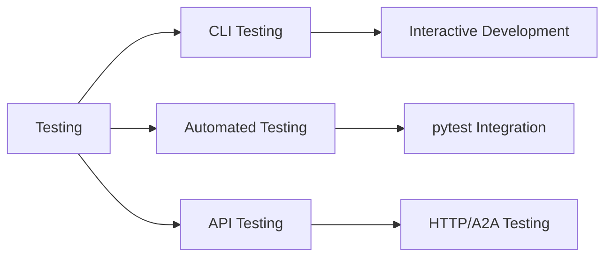

# Testing Overview

Agent Kernel provides a comprehensive testing framework for testing CLI-based agents with both interactive and automated test capabilities.

## Testing Approaches



## CLI Testing

Interactive testing of CLI agents. Two independent classes, wired together by your test code:
`CLIClient` drives the CLI subprocess, `Test` compares the captured response:

```python
from agentkernel.test import CLIClient, Test

# CLIClient drives the CLI subprocess
client = CLIClient("demo.py")
await client.start()

# Send messages and verify responses
await client.send("Who won the 1996 cricket world cup?")
Test.compare(client.last_agent_response, ["Sri Lanka won the 1996 cricket world cup."])

await client.stop()
```

Best for:
- Development and debugging
- Interactive exploration
- Quick validation of agent responses

[Learn more →](./cli-testing)

## Automated Testing

pytest-based testing with async support:

```python
import pytest
import pytest_asyncio
from agentkernel.test import CLIClient, Test

@pytest_asyncio.fixture(scope="session")
async def test_client():
    client = CLIClient("demo.py")
    await client.start()
    try:
        yield client
    finally:
        await client.stop()

@pytest.mark.asyncio
async def test_basic_question(test_client):
    await test_client.send("Hello!")
    Test.compare(test_client.last_agent_response, ["Hello! How can I help you?"])
```

Best for:
- Regression testing
- CI/CD pipelines
- Validation before deployment

[Learn more →](./automated-testing)

## Testing Framework Features

### Test Comparison Modes

Agent Kernel supports three comparison modes for validating agent responses:

#### Fuzzy Mode
Uses fuzzy string matching (via RapidFuzz) with configurable thresholds:

```python
from agentkernel.test import CLIClient, Mode, Test

# Use fuzzy mode only
client = CLIClient("demo.py")
await client.send("Who won the 1996 cricket world cup?")

# expected is a list - test passes if ANY match exceeds threshold
Test.compare(
    actual=client.last_agent_response,
    expected=["Sri Lanka won", "Sri Lanka won the 1996 cricket world cup"],
    threshold=80,
    mode=Mode.FUZZY
)
```

**Note:** The `expected` parameter is a list. The test passes if the actual response matches **any** of the expected values above the threshold.

#### Judge Mode
**Not currently implemented.** Judge mode previously used Ragas for LLM-based semantic
similarity evaluation; that integration has been removed and `Mode.JUDGE` currently raises
`NotImplementedError`. A replacement built on the `AKEvaluator` abstraction is planned.

#### Fallback Mode (Default)
Tries fuzzy matching first, falls back to judge evaluation if fuzzy fails — since judge mode
isn't implemented yet, this currently means a fuzzy-match failure raises `NotImplementedError`:

```python
# Default fallback mode - multiple expected answers
Test.compare(
    actual=client.last_agent_response,
    expected=[
        "Sri Lanka",
        "Sri Lanka won the 1996 cricket world cup",
        "The winner was Sri Lanka"
    ],
    user_input="Who won the 1996 cricket world cup?",
    threshold=50,
    mode=Mode.FALLBACK  # or None to use config default
)
```

**Note:** The `expected` parameter is a list of acceptable responses. The test passes if **any** expected value matches (fuzzy or judge evaluation).

### Configuring Test Mode

Set the default test mode via a `test-config.yaml` file in the directory you run the tests from. Test configuration is separate from the application's `config.yaml` and is only loaded when the test harness runs (a `test:` section in `config.yaml` is ignored):

```yaml
# test-config.yaml
mode: fallback  # Options: fuzzy, judge, fallback
judge:
  model: gpt-4o-mini
  provider: openai
  embedding_model: text-embedding-3-small
```

Use `AK_TEST_CONFIG_PATH_OVERRIDE` to load the file from a different path:

```bash
export AK_TEST_CONFIG_PATH_OVERRIDE=/path/to/test-config.yaml
```

Or via environment variables:

```bash
export AK_TEST__MODE=judge
export AK_TEST__JUDGE__MODEL=gpt-4o-mini
export AK_TEST__JUDGE__PROVIDER=openai
export AK_TEST__JUDGE__EMBEDDING_MODEL=text-embedding-3-small
```

### Session Management
Tests maintain persistent CLI sessions with proper prompt handling and ANSI escape sequence cleanup.

### Multi-Agent Support
Test different agent types within the same CLI application:

```python
await client.send("!select general")  # Switch to general agent
await client.send("Who won the 1996 cricket world cup?")
```

## Best Practices

- Use pytest fixtures for test setup and teardown
- Implement ordered tests for conversation flows
- Configure appropriate fuzzy matching thresholds
- Test agent selection commands when using multi-agent setups
- Include both positive and negative test cases
- Test session persistence and state management
