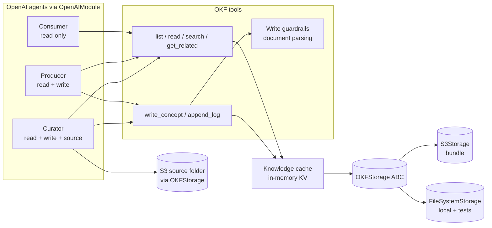

# 499-OKF-exploration: Open Knowledge Format (OKF) example on Agent Kernel

A self-contained example that implements the Open Knowledge Format (OKF) — an open, vendor-neutral
specification for markdown knowledge bundles that agents navigate like a file system — on top of
Agent Kernel, with an abstract storage layer (S3 first) and three agents (Consumer, Producer,
Curator). The example use case: sync markdown files from a given S3 source folder into an OKF
bundle, then ask questions against the bundle and update it through agents.

Sources:

- OKF concept/spec: [How the Open Knowledge Format can improve data sharing](https://cloud.google.com/blog/products/data-analytics/how-the-open-knowledge-format-can-improve-data-sharing)
  (Google Cloud, OKF v0.1)
- Architecture sketch: `docs/specs/499-OKF-exploration/Open Knowledge Format.drawio.xml`
  (pages: Concept, Design, Consumer Flow, Producer Flow, Curator Flow)

## Motivation

- OKF formalizes the "LLM-wiki" pattern: a directory tree of markdown **concept** documents an
  agent can browse, search, and edit with a small tool surface — no vector store or retrieval
  pipeline required. It is "just markdown, just files, just YAML frontmatter" and explicitly
  framework-neutral, which makes it a natural fit to demonstrate on Agent Kernel.
- OKF's three design principles constrain this design: **minimally opinionated** (only the
  `type` frontmatter field is required), **producer/consumer independence** (authoring and
  consumption are cleanly separated — mirrored here by the agent/tool split), and
  **format, not platform** (no proprietary SDK; the bundle stays portable plain files on S3).
- Agent Kernel's existing `KnowledgeBase` ABC (`ak-py/src/agentkernel/knowledgebase/base.py:7`)
  is query-shaped (`read(query, limit)`, `write(records)`); OKF's tool surface is path- and
  navigation-shaped (`list_concept(path)`, `get_related(path)`, `append_log(...)`) and does not
  map onto it — hence an exploration as an example first, not a new library backend.
- Examples in this repo are self-contained `uv` projects whose top-level directory is the
  **interface/target** (`cli`, `api`, `aws-serverless`, …), not the runtime; a framework example
  is `examples/<interface>/<runtime>/` (e.g. `examples/cli/openai/`), and concept examples nest
  a runtime beneath the concept (e.g. `examples/cli/knowledgebase/openai/<backend>/`). Each is a
  self-contained project with `demo.py`, `demo_test.py`, `README.md`, `pyproject.toml`, `build.sh`,
  `uv.lock`, depending only on published `agentkernel[...]` extras — this example follows that shape.

## The OKF format (per the OKF v0.1 spec and the Concept page)

- A **bundle** is a directory tree of markdown files, each representing a **concept** — anything
  worth capturing (tables, datasets, metrics, playbooks, runbooks, APIs), e.g.
  `sales/{index.md, log.md, datasets/, tables/, metrics/}`.
- **File path = concept identity** — there is no separate ID field.
- Every concept document has two parts:
  - **Metadata block**: YAML frontmatter. Only **`type`** is required (e.g. `BigQuery Table`);
    standard optional fields are `title`, `description`, `resource` (URL to the real underlying
    asset), `tags` (list), `timestamp` (ISO-8601 last-modified).
  - **Document details**: free markdown body — the spec is minimally opinionated; producers
    define their own sections (schema tables, join paths, usage notes, etc.).
- **Relationships** are ordinary markdown links between concept documents
  (e.g. `[orders](/tables/orders.md)`), forming a graph richer than the directory hierarchy.
- **Reserved filenames** (optional but recommended, and used throughout this example):
  - **`index.md`** per directory: a curated listing of that directory's concepts — enables
    **progressive disclosure**, letting agents navigate the hierarchy incrementally.
  - **`log.md`** at the bundle root: a chronological, date-sectioned history of changes
    (`## 2026-05-28` → `* **Update**: ...` entries linking to touched documents).

## Requirements

### Example package

- Lives at `examples/cli/okf/openai/` (concept → runtime, mirroring the
  `examples/cli/knowledgebase/openai/<backend>/` precedent and leaving room for other runtimes),
  following the existing CLI example layout: `demo.py`, `demo_test.py`, `okf/` (the OKF
  implementation package), `sample_source/` (committed sample markdown the Curator syncs — see below),
  `deploy/` (Terraform that provisions the S3 buckets — see Deployment), `README.md`,
  `pyproject.toml`, `build.sh`, `uv.lock`.
- Depends on `agentkernel[cli,openai]` plus `boto3` and `pyyaml` at runtime, and
  `agentkernel[test]` as a dev dependency (the `Test` harness, as in `examples/cli/openai`);
  **no changes to the ak-py library** (no new config sections, extras, factories, or exports).
- The committed sample data is **`sample_source/`** (a small set of plain-markdown documents).
  The OKF **bundle** it syncs into (`sample_bundle/`) is *generated* by the Curator sync and is
  **not committed** (git-ignored): a fresh checkout starts with an empty bundle and is populated
  by running the sync. The offline tests build their own bundles in temp directories and never
  depend on a committed one.
- README documents: the OKF format, a **local filesystem run path** (no AWS — point the bundle
  at a local directory, see Storage abstraction), the S3 path (provision the two buckets and
  their IAM policies with the `deploy/` Terraform — see Deployment — then point the demo at
  them), how to seed the source folder, and a scripted walkthrough of the three flows
  (sync → ask → update).

### Deployment (S3 provisioning)

- A `deploy/` Terraform module provisions the AWS resources the S3 run path needs, mirroring the
  repo's Terraform convention (`agent/deploy/`, `ak-deployment/`): standard files
  `main.tf`, `variables.tf`, `outputs.tf` (and an optional `backend.tf` for remote state that can
  be deleted for local state, as in `agent/deploy/backend.tf`).
- It creates **two S3 buckets** and their access policies:
  - the **bundle (OKF wiki) bucket** — the durable home of the OKF bundle; the demo needs
    **read-write** on it (`s3:GetObject`, `s3:PutObject`, `s3:ListBucket`).
  - the **source bucket** — the folder the Curator syncs *from*; the demo needs **read-only** on
    it (`s3:GetObject`, `s3:ListBucket`, never `s3:PutObject` / `s3:DeleteObject`), the
    defence-in-depth grant the Agents section relies on.
- Bucket names, prefixes, and region are Terraform **variables**; `outputs.tf` emits the created
  bucket names/prefixes so they can be fed straight into the demo's `S3Storage` constructor
  params. The two IAM policies (RW bundle, RO source) are the concrete form of the read-write /
  read-only split the design describes — the tool subset is the in-process permission model, and
  these policies are the same split enforced at the AWS boundary.
- `deploy/` **only** provisions buckets and policies. It does not create IAM *users* or wire
  credentials — the operator attaches the emitted policies to whatever principal runs the demo
  (see Non-goals). The application code never creates buckets: `S3Storage` assumes the buckets
  exist (it takes explicit bucket/prefix/region and never provisions), so provisioning stays
  entirely in `deploy/`.

### Storage abstraction

- `OKFStorage` ABC with a mostly-blob surface plus one metadata probe:
  - `read(path) -> str` — raises a not-found error for missing paths
  - `write(path, content) -> None`
  - `list(prefix) -> list[str]` — recursive listing of document paths under a prefix
  - `exists(path) -> bool`
  - `last_modified(path) -> datetime | None` — a path's last-modified time without reading its
    content (`FileSystemStorage` uses file mtime; `S3Storage` uses the object's `LastModified`)
- The surface stays **content-only except for `last_modified`** — the single metadata probe sync
  needs. Consequences the rest of the design relies on:
  - sync freshness is decided by the source file's **last-modified time**, recorded on the synced
    document as `source_timestamp` (see Use case 1), and
  - a document's `timestamp` frontmatter is the wall-clock **write** time, kept separate from the
    source mtime that drives freshness.
- Paths are bundle-relative POSIX paths (`tables/orders.md`); the storage maps them to its
  backend addressing.
- Storage classes take **explicit constructor parameters** (bucket, prefix, region) — they never
  read global config (mirrors the shared-driver rule in core).
- Two implementations in the example, both first-class:
  - `S3Storage` (boto3) — the cloud/production-like backend; bundle root = `s3://<bucket>/<prefix>/`
  - `FileSystemStorage` — a local directory; the **no-AWS run path** documented in the README as
    well as the backend used by `demo_test.py` and offline runs. Choosing the backend is the only
    difference between running the example locally and against S3.
- The **sync source folder** is read through the same `OKFStorage` interface (a second instance
  pointed at the source bucket/prefix) — no separate source-reader abstraction. This instance is
  used **read-only**: only the Curator reaches it, only via the read/list source tools, and (for
  `S3Storage`) it is documented as needing read-only IAM on the source bucket (see Agents).

### Knowledge cache

- In-memory KV cache (`dict[path, content]`) in front of storage, per the Design page:
  - reads are read-through: hit → return cached; miss → fetch from storage, store, return
  - writes update/invalidate the cached entry for that path
- The cache fronts the **bundle** `OKFStorage` instance only. The **source** instance
  (`list_source_files` / `read_source_file`) is read directly, uncached — matching the component
  diagram (`Curator → source`, not through the cache) — since source reads happen once per sync.
- Process-local and unbounded for the example; no TTL, no cross-process invalidation. Bundles are
  assumed small enough to hold in memory, so an unbounded cache is acceptable for the exploration.

### Agent-facing tools

- Plain Python functions over one shared `OKFBundle` object (bundle storage + source storage +
  cache + validation), each wrapped with the OpenAI Agents SDK's `function_tool` and bound per
  agent by passing the selected subset to the `Agent`'s `tools=` argument.
  - The tools are thin closures over that single `OKFBundle`; the only thing that differs between
    the Consumer, Producer, and Curator is **which subset** of tools each agent is bound — the
    tool subset *is* the permission model (see Agents).
  - **Wrapping with `function_tool` directly is deliberate** (not `OpenAIToolBuilder.bind`): the
    OKF tools are closures over a single `OKFBundle`, and this example's point is the
    *tool-subset-as-permission-model* pattern, for which the SDK's own decorator is the most
    direct surface. `OpenAIToolBuilder.bind` wraps with `function_tool` internally, so the two are
    functionally equivalent here.
- **Read tools**:
  - `list_concept(path)` — returns the directory's `index.md` content; when the directory has
    no `index.md` (optional in a minimally-opinionated bundle), returns a generated listing of
    the document paths directly under that directory so navigation still works
  - `read_concept(path)` — returns document details + parsed metadata
  - `search_concept(path, keyword)` — keyword search scoped by `path`:
    - `path` is a file: search only that document (frontmatter + body)
    - `path` is a directory: recursively search every document under it
    - substring match (case-insensitive) against raw document text, no embeddings/ranking;
      returns matching documents' paths + the matching line(s) for context
    - returns at most **N matching documents** (default 20) and notes when results were
      truncated, so a broad keyword can't flood the agent's context (mirrors the library
      `KnowledgeBase.read(limit=…)` behavior)
  - `get_related(path)` — parses markdown links in the document; returns linked bundle paths
- **Link resolution** (shared by `get_related` and the write guardrail's link check):
  - **absolute** links (`/tables/orders.md`) resolve from the **bundle root**
  - **relative** links (`../orders.md`) resolve relative to the current document's directory
  - both normalize to a bundle-relative POSIX path; authored and synced documents use the
    **absolute-from-root** form as the canonical style so authored and validated links agree
- **Write tools**:
  - `write_concept(path, content)` — create or replace a document, gated by write guardrails
    (below); on success persists to storage and updates the cache, then **regenerates the touched
    directory's `index.md` and every ancestor index up to the bundle root** as flat mechanical
    listings (see the invariant note)
- **Special tools**:
  - `append_log(log_details)` — appends an entry under today's date section in `log.md`
- **`index.md` is a tool-enforced invariant, `log.md` is a best-effort audit trail:**
  - `index.md` drives progressive-disclosure navigation, so `write_concept` regenerates the
    touched directory's `index.md` **and cascades up to every ancestor index through the bundle
    root, in the write path itself** on every create/replace — the index staying correct is never
    left to an agent's prompt. The cascade (rather than the touched directory alone) is what keeps
    a freshly written subtree reachable from the root: writing `sales/tables/orders.md` into an
    empty bundle also creates `sales/tables/index.md`, `sales/index.md`, and the root `index.md`.
  - **Cost of the cascade:** each write re-reads every sibling document in each ancestor directory
    (to pull its `title`/`type` for the listing). This is bounded by directory fan-out and
    mitigated by the bundle cache (siblings are almost always already cached), an acceptable
    per-write cost for the reachability guarantee at this example's scale.
  - The regenerated index is a **flat mechanical listing** — one entry per document directly
    under the directory (`[title](/path.md) — type`, title/description pulled from frontmatter),
    not a merge that preserves hand-authored ordering, grouping, or prose. **This is a deliberate
    tradeoff:** the format section frames `index.md` as a *curated* listing, but in a
    producer/curator-driven bundle any curation of a directory's index survives only until the
    next `write_concept` into that directory, which overwrites it with the generated form.
    The exploration chooses navigation correctness (the index always reflects the directory's
    real contents) over curation; preserving curated indexes across writes is out of scope
    (see Non-goals).
  - `log.md` is a human-facing history, not a navigation invariant; it is maintained through the
    explicit `append_log` tool (per-write entries from the Producer, a per-run summary from the
    Curator). A missed log entry degrades the audit trail but doesn't break the bundle, so this
    stays prompt/flow-driven rather than automatic.
- Tool errors (invalid path, missing document, failed validation) return descriptive error
  strings to the agent rather than raising — the agent can self-correct.

### Write guardrails

- Implemented as **document parsing/validation inside the write path** (the Design page's
  "Document Parsing" guardrail); not wired into Agent Kernel's guardrail-provider system.
- Validation follows OKF v0.1 conformance — only `type` is mandatory. `write_concept` rejects,
  with `error + reason` returned to the agent (Producer Flow `[fail]` branch), when:
  - frontmatter is missing or not valid YAML
  - the `type` field is absent (the spec's only required field)
  - standard optional fields are present but malformed: `tags` not a list, `timestamp` not
    ISO-8601, `resource` not a URL
  - links in the body (absolute-from-root **or** relative, both resolved per the shared link
    resolution above) point outside the bundle or to non-`.md` targets
- Missing optional fields (`title`, `description`, `timestamp`) produce a warning in the tool
  response, not a rejection — the agents' prompts instruct them to always populate these, but
  the format itself stays minimally opinionated.
- Links to not-yet-existing bundle documents are allowed (warn, don't reject) — bundles are
  built incrementally.
- Content-safety guardrails ("Normal Guardrails (Optional)" in the diagram) are out of scope.

### Agents

- Three OpenAI Agents SDK agents loaded via `OpenAIModule`, matching the roles OKF itself
  implies (producer authors, consumer reads, curator manages content like code) and differing
  only in system prompt and tool subset — the tool split is the permission model:
  - **Consumer** (read-only): `list_concept`, `read_concept`, `search_concept`, `get_related`.
    Q&A over the bundle; prompt instructs it to start discovery at the root `index.md`.
  - **Producer** (read + write): Consumer tools + `write_concept`, `append_log`.
    Applies user-requested updates; prompt requires it to (1) validate-by-reading first and
    (2) `append_log` after every successful write. Updating the affected `index.md` is **not** a
    prompt duty — `write_concept` does it automatically (see the invariant note above).
    **No source access** — the Producer only ever touches the bundle.
  - **Curator** (read + write + read-only source): Producer tools + the source tools
    `list_source_files()` / `read_source_file(path)`. Executes the sync flow on demand. Beyond the
    deterministic `sync_source()` mirror, the Curator's *prompt* also drives a **categorized
    import**: it reads the source and authors concepts into meaningful category subtrees (e.g.
    `characters/`, `places/`, `incidents/`, `things/`, `relationships/`, `themes/`) via
    `write_concept`, cross-linking related concepts. This uses only tools it already holds, so the
    tool/permission contract is unchanged — the categorization is a prompt/demo choice, not new
    Curator tooling.
- **Only the Curator has source access, and it is read-only.** The source is exposed *only*
  through `list_source_files()` / `read_source_file(path)` — thin wrappers over a **second
  `OKFStorage` instance** pointed at the source bucket/prefix (so "no separate source-reader
  abstraction" holds). No write/delete tool over the source is ever defined or bound to any
  agent, so read-only is enforced by the tool subset — the permission model — exactly like the
  rest of the design. As defence in depth beyond the tool layer, the source `S3Storage` needs
  only read IAM permissions (`s3:GetObject` + `s3:ListBucket`, never `s3:PutObject` /
  `s3:DeleteObject`); the README documents the source bucket/prefix as a read-only grant,
  distinct from the read-write grant the bundle bucket requires.
- Interface: interactive `CLI.main()` (as in `examples/cli/openai/demo.py`); the user switches
  agents with the CLI's agent selection.

### Use case 1 — sync source folder into the bundle (Curator)

- A deterministic `sync_source()` tool the Curator invokes; triggered on demand from the CLI
  (e.g. "sync the source folder"), not by a scheduler.
- Flow (Curator Flow page, without the scheduler):
  - list source `.md` files; for each, read content and its `last_modified` time
  - transform into an OKF document: preserve/derive frontmatter (derive `title` from filename or
    first heading, default `type: Document` when absent), record the source's last-modified time as
    `source_timestamp`, and stamp the write `timestamp`
  - `write_concept` into the bundle under a dedicated `synced/` subtree mirroring the source
    layout (`write_concept` regenerates each touched `index.md` automatically)
  - `append_log` a single per-run summary of created / updated / skipped docs
- Idempotency (**timestamp-based**): the synced document stores the source file's last-modified
  time as `source_timestamp`. On a re-run a file is skipped when its current last-modified time
  equals the recorded `source_timestamp`; any change to that time re-syncs the document. The
  volatile write `timestamp` is not part of the comparison. When `last_modified` is unavailable
  (`None`), the file is always re-synced.
  - Cost note: each sync reads every already-synced bundle document once to compare `source_timestamp`
    (and warms the cache for them). Acceptable under the "small bundle" assumption above.
- Conflict policy: **source wins**. If a synced document was later hand-edited via the Producer and
  the source's last-modified time then moves, the bundle copy is overwritten and the overwrite is
  logged. Sync only ever touches the `synced/` subtree, so hand-authored documents elsewhere in the
  bundle are never affected.

### Use case 2 — ask questions (Consumer)

- Consumer Flow page: user asks → agent walks `index.md` → `read_concept` / `search_concept` /
  `get_related` → answers with the document's `resource` link cited where relevant.
- Reads hit the knowledge cache first (hit/miss behavior per the flow diagram).

### Use case 3 — update the system (Producer)

- Producer Flow page: user requests a change → agent reads the current document →
  `write_concept` (validated) → cache updated → `append_log` → success reported;
  validation failure returns the reason and the agent revises.

### Testing

- **Unit tests (offline, no external deps)** — `FileSystemStorage` against a temp-directory
  bundle; no AWS and no model key:
  - format round-trip: write a valid document → read back identical content + parsed metadata
  - guardrails: missing frontmatter / missing required field / out-of-bundle link (absolute
    and relative) → rejected with reason
  - `index.md` invariant: `write_concept` of a new document regenerates its directory's
    `index.md` to include the new entry (asserted directly, not via agent prompt)
  - cache: second read served without a storage call; write refreshes the cached entry
  - storage `last_modified` reports file mtime and `None` for a missing path; source tools are
    read-only (reading the source creates no bundle document, no source write/delete tool exists)
  - sync: seed a source dir with pinned mtimes → sync creates OKF docs under `synced/`, `index.md`
    regenerated and `log.md` summarized; re-sync with unchanged source mtimes writes nothing new
    (timestamp idempotency), and bumping one source file's mtime re-syncs just that file
- **Agent smoke test (requires a live model key)** — uses the `Test("demo.py")` harness (as in
  `examples/cli/openai/demo_test.py`), which starts the real agents and drives the full three-role
  flow over the committed `sample_source/`: the Curator syncs the source into a freshly cleaned
  `sample_bundle/`, the Consumer answers a question grounded in the synced content, and the
  Producer writes a new concept the Consumer then reads back (proving a write is visible
  end-to-end across the shared in-process bundle). This is the one test that is not offline — it
  needs an OpenAI API key and is skipped when none is present (matching how the other CLI examples
  behave in CI).

## Component overview

## Non-goals

- No changes to the ak-py library: no `AKConfig` section, no optional-dependency extra, no
  factory registration, no public exports.
- No SQL storage implementation (the Design page lists it as a possible backend; S3 + filesystem
  suffice for the exploration).
- No scheduler/cron infrastructure for the Curator (diagram shows it; the example triggers sync
  on demand).
- No IAM user/credential provisioning in `deploy/` — it creates the two buckets and their access
  policies only; attaching those policies to the principal that runs the demo (and supplying its
  credentials) is left to the operator. No remote Terraform state backend is required (the
  optional `backend.tf` can be deleted for local state).
- No *automated* "reconcile / enrich" duties for the Curator (the diagram's link-fixing / bulk
  index regeneration beyond the per-write `index.md` update) as dedicated tooling. The
  deterministic `sync_source()` stays a raw mirror; the richer categorized import is prompt-driven
  via `write_concept` (see Agents), not new Curator tooling.
- No preservation of curated `index.md` content across writes — `write_concept` regenerates a
  flat mechanical listing, so hand-authored ordering, grouping, and prose in a directory's index
  do not survive the next write to that directory (see the `index.md` invariant note).
- No stricter-than-spec validation profile: the example enforces OKF v0.1 exactly (only `type`
  required); missing optional fields warn, they do not reject.
- No vector/semantic search — `search_concept` is a path-scoped keyword (substring) search over
  raw document text, not ranked or embedding-based.
- No content-safety guardrail provider integration for writes.
- No distributed or persistent knowledge cache (in-memory per process only).
- No REST/MCP/A2A exposure — CLI only.

## Decisions (previously open, now settled)

- **Placement**: `examples/cli/okf/openai/` (concept → runtime, per the
  `examples/cli/knowledgebase/openai/<backend>/` precedent).
- **Framework / interface**: OpenAI Agents SDK, interactive CLI (matching `examples/cli/openai`).
- **Validation strictness**: follow OKF v0.1 exactly — only `type` required, missing optional
  fields warn (a stricter house profile would undercut "this is what OKF is"). See Non-goals.
- **Sync target layout**: a dedicated `synced/` subtree mirroring the source layout (not the
  bundle root). See Use case 1.
- **Sync idempotency**: timestamp-based — the synced document records the source's last-modified
  time (`source_timestamp`) and a re-sync skips files whose source mtime is unchanged. See Use case 1.
- **Sync conflict policy**: source wins. See Use case 1.
- **Reconcile / enrich**: out of scope for the first cut. See Non-goals.
- **S3 provisioning**: a `deploy/` Terraform module creates the two buckets (RW bundle, RO
  source) and their IAM policies, rather than leaving them as README-only prerequisites or
  auto-creating them in `S3Storage`. Keeps provisioning out of the app code and matches the
  repo's Terraform convention. See Deployment.

## Open questions

- If the exploration succeeds, the follow-up decision is whether OKF is promoted into the
  library (as a `knowledgebase` sibling package with config/extras/tests) — out of scope here,
  but the storage ABC is shaped so that promotion doesn't require redesign.
