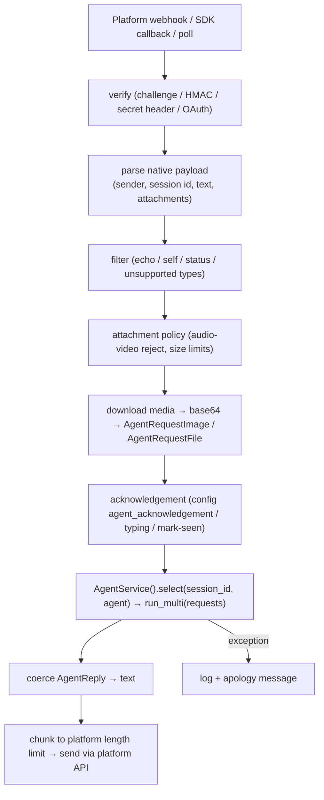
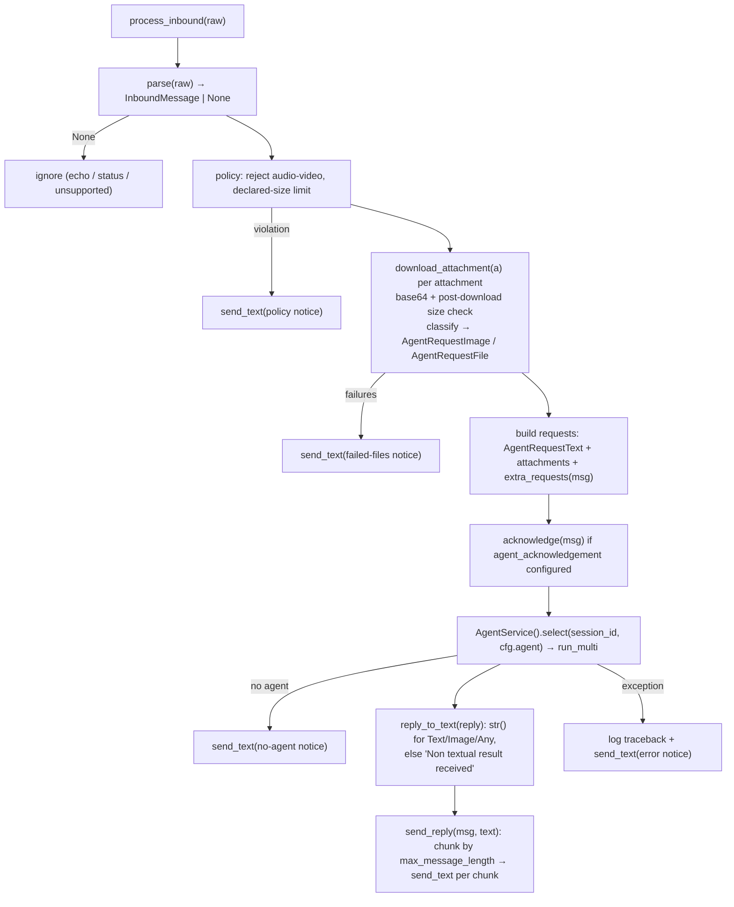

# #524: Pluggable request/response adapter for messaging integrations

> GitHub [#524](https://github.com/yaalalabs/agent-kernel/issues/524) (migrated from JIRA AK-159).

Introduce a base adapter that owns the shared orchestration of every messaging integration's
message path — parse → policy checks → attachment materialization → acknowledgement → agent run →
reply coercion → chunked send → error handling — behind a small, controlled, **pluggable**
interface. Platform handlers (Slack, WhatsApp, Teams first; Messenger, Instagram, Telegram, Gmail
as follow-ups) become thin plugins that implement only the platform-native request-parsing and
response-sending edges. Downstream users get the same contract to bring their own platform
integration without forking Agent Kernel.

## Current message path (as-is)

All seven integrations under `integration/` independently implement the same conceptual pipeline.
The generic flow today:



Every stage of that pipeline is re-implemented per platform, with no shared interface:

| Stage | Slack (`slack/slack_chat.py`) | WhatsApp (`whatsapp/whatsapp_chat.py`) | Teams (`teams/teams_chat.py`) | Messenger / Instagram / Telegram / Gmail |
| --- | --- | --- | --- | --- |
| Transport | slack-bolt `AsyncApp` + `/slack/events` | FastAPI `GET/POST /whatsapp/webhook` | BotFramework adapter + `/teams/messages` | Meta webhook ×2 / Telegram webhook / Gmail OAuth polling |
| Verification | bolt-internal | hub challenge + HMAC-SHA256 | BotFramework auth | hub challenge + HMAC ×2 / secret header / OAuth |
| Session id | `thread_ts` | `from_number` | `conversation.id` | `sender_id` ×2 / `chat_id` / `thread_id or sender` |
| Size check | pre-download (declared) | pre-download (media info) | post-download | post ×2 / pre+post / none |
| Reply coercion | `isinstance` check (`slack_chat.py:157`) | plain `str(result)` (`whatsapp_chat.py:294`) | `isinstance` check (`teams_chat.py:294`) | `hasattr(result, "raw")` idiom, verbatim in all four |
| Chunking | 3000-char Block Kit, 5-block cap | 4096-char loop (`whatsapp_chat.py:319`) | none | 2000 / 1000 / 4096 (same loop) / none |
| Agent invocation | `run_multi` | `run_multi` | `run_multi` | `run` vs `run_multi` decided ad hoc |

### Duplication and drift evidence

The issue's premise — "duplicated, inconsistent, and easy to drift out of sync" — is observable
on `develop` today:

1. **Teams handler crashes at construction.** `teams_chat.py:40` reads `Config.get().teams.agent`,
   but `AKConfig` has no `teams` field (`core/config.py:561-590`) and the settings base uses
   `extra="ignore"` — verified: `AKConfig().teams` raises `AttributeError`. The config section was
   dropped when #202 was rebased and nothing shared enforces the handler↔config contract.
2. **Two reply-coercion idioms.** Slack/Teams use an `isinstance((AgentReplyText, AgentReplyImage,
   AgentReplyAny))` check with a "Non textual result received" fallback; WhatsApp uses bare
   `str(result)`; Messenger/Instagram/Telegram/Gmail all carry a verbatim
   `hasattr(result, "raw")` branch — a CrewAI-ism that leaked into platform code.
3. **Attachment size limits are enforced four different ways** (see table), and Gmail enforces
   none.
4. **Self-message/echo filtering is inconsistent.** Slack filters its own bot id, Instagram
   filters `is_echo`, Messenger — the same Meta surface — does not.
5. **Messenger ≡ Instagram are ~95% identical files** (~400 lines each): `_verify_webhook`,
   `_verify_signature`, `_process_attachment`, `_send_message`, `_send_typing_indicator`,
   `_mark_seen` differ only in host strings and docstrings.
6. **Zero tests.** `ak-py/tests/` contains no `test_slack.py` / `test_whatsapp.py` /
   `test_teams.py` — the pipeline is untestable without a live platform because parsing,
   orchestration, and HTTP sends are interleaved in one method.
7. **Integrations bypass `ChatService`.** The REST path centralizes request building, validation,
   and thread support in `core/chat_service.py`; integrations call `AgentService` directly, so
   fixes on one path don't reach the other.

`docs/specs/541-pluggable-backend-factories/design.md` explicitly deferred messaging integrations
("selected/constructed differently … not in scope unless later decided"). #524 is that decision:
integrations don't get a config-`type` factory, they get a **shared base class contract**.

## What the issue asks for

- **Problem:** each integration implements request-parsing and response-formatting independently
  with no shared, controlled interface.
- **Fix:** a base adapter class that owns the shared orchestration.
- **Scope:** build the base, then migrate **Slack, WhatsApp, and Teams** onto it to prove it
  removes the duplication. (Other platforms follow after the pattern is proven.)

## Design

### Placement and dependency rules

```
ak-py/src/agentkernel/integration/
├── base/
│   ├── __init__.py        # public exports
│   ├── model.py           # InboundMessage, InboundAttachment
│   ├── adapter.py         # MessagingAdapter, WebhookMessagingAdapter
│   └── testing.py         # FakeMessagingAdapter, MessagingAdapterContract (BYO test kit)
├── slack/slack_chat.py    # becomes a MessagingAdapter plugin (public name unchanged)
├── whatsapp/…             # 〃
└── teams/…                # 〃
```

- `integration/base` depends on `core` (`AgentService`, `Config`, request/reply models) and `api`
  (`RESTRequestHandler`) only. The hard rule that **core never depends on `integration/`** is
  unchanged.
- Public names and import paths (`AgentSlackRequestHandler`, `agentkernel.slack`, …) are
  **unchanged** — migration is internal to each handler.

**Reconciling with "wrap, don't abstract over" (AGENTS.md).** The base class abstracts the
*AK-side* of the pipeline — policy enforcement, agent invocation, reply coercion, error handling —
which is Agent Kernel logic, not platform logic. The *platform-side* edges stay fully native:
Slack keeps slack-bolt, Teams keeps the BotFramework adapter and `TurnContext`, WhatsApp keeps raw
Graph API calls. The contract never forces a platform capability (no fake streaming, no forced
typing indicators); platform quirks live in the plugin, not the base.

### Normalized boundary models (`integration/base/model.py`)

The controlled interface between "platform-native" and "shared orchestration":

```python
@dataclass
class InboundAttachment:
    name: str
    mime_type: str | None
    size: int | None            # declared size when the platform provides one (pre-download check)
    ref: Any                    # opaque platform handle: URL, media_id, file_id, …

@dataclass
class InboundMessage:
    session_id: str             # platform-chosen conversation key (thread_ts, from_number, …)
    text: str | None
    attachments: list[InboundAttachment]
    user_id: str | None = None  # future ChatService/thread convergence hook
    reply_context: Any = None   # opaque send handle: bolt `say`, TurnContext, (from, message_id)
    raw: Any = None             # original native payload, for extra_requests / debugging
```

`reply_context` and `ref` are deliberately opaque (`Any`): the base never interprets them, it only
hands them back to the plugin's send/download hooks. That is what lets slack-bolt and BotFramework
objects flow through the shared pipeline without an intermediate re-modeling of each platform.

### `MessagingAdapter` — the shared orchestration (template method)

Transport-agnostic core. One public entry point that owns the pipeline:

```python
class MessagingAdapter(ABC):
    platform: ClassVar[str]                          # config namespace + log namespace ("slack", …)
    max_message_length: ClassVar[int | None] = None  # None = no chunking
    rejected_mime_prefixes: ClassVar[tuple[str, ...]] = ("audio/", "video/")

    async def process_inbound(self, raw: Any) -> None:  # owned by the base — not overridden
        ...
```

`process_inbound(raw)` runs the pipeline; the platform's transport (webhook route, bolt callback,
BotFramework `bot_logic`, poll loop) does nothing but hand its native payload to it.



The contract, stage by stage:

| Hook | Kind | Default | Platform responsibility |
| --- | --- | --- | --- |
| `parse(raw) -> InboundMessage \| None` | **abstract** | — | Extract session id, text, attachment refs, reply context from the native payload. Return `None` to ignore (echoes, self-messages, delivery/read statuses, unsupported types). Native SDK objects allowed throughout. |
| `send_text(message, text)` | **abstract** | — | One platform API send. The only outbound primitive the base requires. |
| `download_attachment(att) -> bytes \| None` | abstract-when-used | raises `NotImplementedError` | Fetch bytes for one `InboundAttachment.ref` (Slack bearer download, WhatsApp media API, Teams MSAL/tempauth). Base handles base64, size verification, image-vs-file classification. |
| `acknowledge(message) -> Any` | overridable | sends `cfg.agent_acknowledgement` via `send_text` when configured | Slack overrides: post placeholder with loader emoji, return its `ts`, update it before the final reply. |
| `extra_requests(message) -> list[AgentRequest]` | overridable | `[]` | Slack appends `AgentRequestAny(name="body", content=body)` (today's `slack_chat.py:151`). |
| `send_reply(message, text, ack)` | overridable | chunk by `max_message_length`, `send_text` each chunk | Slack overrides for Block Kit sections, 5-block cap, thread metadata. WhatsApp keeps its reply-`context` on the first chunk only. |
| notice texts (`error_text`, `no_agent_text`, `rejected_files_text(names)`, …) | overridable | shared defaults | **Converge on the shared defaults** (decided, see below); override only where the text carries platform mechanics, e.g. Slack's `<@user>` mention. |
| `process_inbound`, policy checks, request building, `AgentService` invocation, `reply_to_text`, chunk loop, error handling | **base-owned** | shared | Not overridden — this is the "controlled" part of the interface and the code that can never drift again. |

Cross-cutting rules the base enforces uniformly (today: four divergent behaviors):

- **Reply coercion** is one shared `reply_to_text()`: `str(reply)` for `AgentReplyText` /
  `AgentReplyImage` / `AgentReplyAny`, `"Non textual result received"` otherwise. The
  `hasattr(result, "raw")` idiom is retired at migration time.
- **Attachment size limits** are always checked against `Config.get().api.max_file_size`:
  pre-download when the platform declares a size, post-download always.
- **Config contract**: the base resolves `Config.get().<platform>` from the `platform` class
  attribute and applies the `"" → None` idiom for `agent` / `agent_acknowledgement`. A missing
  config section fails at construction with an actionable error naming the missing block —
  turning drift of the Teams kind (evidence #1) from a runtime `AttributeError` into an explicit
  contract violation.
- **Error policy**: exceptions from the run are logged with traceback and answered with the
  platform's error notice; webhook routes still return 200 so platforms don't retry poisoned
  messages (today's behavior, kept).

### `WebhookMessagingAdapter(MessagingAdapter, RESTRequestHandler)` — the REST transport

Adds the FastAPI surface shared by all webhook platforms, without owning their routes:

- `get_router()` builds the router, adds the common `GET /health`, then calls the plugin's
  `register_routes(router)` — each platform mounts its own paths and keeps its native dispatch
  (bolt's `AsyncSlackRequestHandler.handle`, BotFramework's `process_activity`, plain webhook
  POSTs). No forced single-route shape.
- Shared **verification helpers** (plain methods, used by the platforms that need them):
  - `verify_meta_challenge(request)` — the `hub.mode` / `hub.verify_token` / `hub.challenge`
    handshake (WhatsApp today; Messenger/Instagram in phase 3).
  - `verify_hmac_sha256(body, header_value, secret)` — `sha256=`-prefixed HMAC compare with
    `hmac.compare_digest` (WhatsApp today; Messenger/Instagram in phase 3).
  - `verify_secret_header(request, header, secret)` — constant-time compare (Telegram, phase 3).

`MessagingAdapter` itself stays transport-agnostic so Gmail's polling model can later subclass it
directly (sharing the whole pipeline, none of the webhook surface) — accommodated by design, not
migrated in this issue.

### Pluggability — the point of the design

Three plug surfaces, one contract:

1. **In-tree platforms** plug `parse` / `send_text` / `download_attachment` into the shared
   pipeline. Adding platform N+1 means implementing the table above — not re-deriving policy
   checks, coercion, chunking, and error handling from a copied file.
2. **Bring-your-own platform (downstream).** `MessagingAdapter` / `WebhookMessagingAdapter` and
   the two boundary models become **public, stability-bearing interfaces** (same status as the
   #541 ABCs — a signature change is a breaking change for plugin authors). A user integrates an
   unsupported platform (Discord, LINE, …) by subclassing in their own package and passing the
   instance to `RESTAPI.run([MyDiscordAdapter()])`. No AK fork, no registry, no config `type`
   string: handlers are already constructed in user code, so selection-by-config (the #541
   dotted-path pattern) adds nothing here.
3. **Per-deployment customization.** Because every stage is a named method, a user can subclass a
   *shipped* adapter and override one stage — e.g. a custom `send_reply` that renders corporate
   Slack Block Kit templates — while inheriting the rest of the pipeline unchanged.

### Config changes

- **Add `_TeamsConfig`** to `core/config.py` and a `teams:` field on `AKConfig` — `agent`,
  `agent_acknowledgement`, `app_id`, `app_password`, `tenant_id` (exactly the fields
  `teams_chat.py:40-44` already reads). This is a bug fix folded into the migration; without it
  the Teams handler cannot be constructed at all.
- No other config shape changes. Existing `slack:` / `whatsapp:` blocks, field names, and env-var
  bindings (`AK_SLACK__AGENT`, …) are untouched.

### Migration mapping (issue scope: Slack, WhatsApp, Teams)

| | Moves to base | Stays in plugin (native) |
| --- | --- | --- |
| **Slack** | audio/video + size policy, request building, agent run, coercion, error handling | bolt app + event route, mention stripping, bearer file download, ack-update flow (`acknowledge` override), Block Kit chunking (`send_reply` override), `AgentRequestAny(body)` (`extra_requests`) |
| **WhatsApp** | policy checks, download-failure notices, agent run + ack, coercion, 4096 chunk loop | hub challenge + HMAC (base helpers), message-type parsing (text / interactive / image / document → `InboundMessage`), media-info + media download, reply-`context` on first chunk |
| **Teams** | policy checks, request building, agent run + ack, coercion, error handling | BotFramework `process_activity` route, mention regex, MSAL/tempauth attachment download, `TurnContext.send_activity` as `send_text` |

Line-count expectation: each handler drops roughly the half of its body that is pipeline
boilerplate; what remains is genuinely platform-specific.

### Behavioural changes (all intentional)

1. **Teams works again** — config section added; construction no longer raises `AttributeError`.
2. **WhatsApp reply coercion** switches from bare `str(result)` to the shared `reply_to_text()`
   (non-textual replies now say "Non textual result received" instead of stringifying a repr).
3. **Uniform size enforcement** — WhatsApp gains the post-download verification it lacked; Slack
   behavior unchanged (declared-size pre-check retained).
4. Everything else is behavior-preserving by construction: same routes, same verification, same
   acknowledgement UX, same session-id choices, same 200-always webhook responses.

Phase-3 platforms will additionally retire the `hasattr(result, "raw")` idiom and reconcile the
Messenger/Instagram echo-filter divergence — recorded here, executed in the follow-up.

### Testing

Today the integration layer has zero tests. The split makes the pipeline testable without live
platforms:

- `ak-py/tests/test_messaging_adapter.py` — a `FakeMessagingAdapter` (records `send_text` calls,
  serves canned attachments) driving the base pipeline: ignore-on-`None`-parse, mime rejection,
  pre/post size checks, download-failure notices, acknowledgement, no-agent path, reply coercion
  (all four `AgentReply` shapes), chunk boundaries, error path. Mock `AgentService` per
  `ak-dev-testing-conventions`.
- Per-platform tests for the three migrated handlers: `parse()` against captured payload fixtures
  (Slack event, WhatsApp webhook entry for each message type, Teams activity) and the overridden
  send/ack methods with mocked HTTP.
- **`integration/base/testing.py` ships in phase 1** (the `sandbox/testing.py` precedent):
  - `FakeMessagingAdapter` — a minimal in-tree `MessagingAdapter` (records `send_text` calls,
    serves canned attachments) that the base suite drives; also usable by plugin authors as a
    starting point.
  - `MessagingAdapterContract` — a reusable pytest mixin that runs any `MessagingAdapter` subclass
    through the base-guaranteed behaviors (ignore-on-`None`-parse, mime rejection, pre/post size
    checks, reply coercion over all four `AgentReply` shapes, chunk boundaries, error path). A BYO
    plugin author subclasses it with their adapter to inherit the conformance suite, and the three
    migrated in-tree handlers use it to prove they preserve the contract. Shipping it in phase 1
    (rather than waiting for external demand) means the contract is exercised by our own three
    migrations from day one, so it can't rot before its first external consumer.

### Rollout

1. **Phase 1** — `integration/base/` (models, `MessagingAdapter`, `WebhookMessagingAdapter`),
   public exports, and the reusable test kit (`FakeMessagingAdapter` + `MessagingAdapterContract`)
   plus the base test suite that drives it.
2. **Phase 2 (proves the issue)** — migrate Slack, WhatsApp, Teams; add `_TeamsConfig`;
   per-platform tests; verify the three examples under `examples/api/{slack,whatsapp,teams}`
   still run unchanged.
3. **Phase 3 (follow-up issue)** — migrate Messenger, Instagram (likely via one shared Meta-Graph
   intermediate plugin, collapsing the ~95% duplicate pair), Telegram (background-task dispatch
   and callback-query parsing stay in its plugin).
4. **Phase 4 (separate decision)** — Gmail onto a polling transport over the same
   `MessagingAdapter` core.
5. **Docs/skills sync** — rewrite `.agents/skills/ak-dev-new-messaging-integration` around the
   adapter contract (its current template *is* the duplication this issue removes); root docs and
   bundled-skill sync via the existing `auto-sync-skills-docs` automation.

## Non-goals

- **Routing integrations through `ChatService` / thread support.** Convergence is desirable
  (integrations currently miss thread support entirely) but changes request semantics
  (`user_id` becomes required when threads are enabled); `InboundMessage.user_id` is the
  deliberate seam for that follow-up.
- **Config-driven adapter selection** (dotted-path `type` à la #541) — adapters are constructed
  in user code and passed to `RESTAPI.run()`; BYO needs no factory.
- **Streaming replies to messaging platforms** — no platform surface here supports token
  streaming; per the no-feature-forcing rule the contract stays request/response.
- **Renaming public classes or import paths** — `AgentSlackRequestHandler` et al. keep their
  names; the base is additive.
- **Migrating Messenger, Instagram, Telegram, Gmail in this issue** — the design accommodates
  them (phases 3–4), the issue's proof scope is Slack + WhatsApp + Teams.
- **Uniform platform behavior** — capability differences (Block Kit vs plain text, typing
  indicators, reply threading) remain per-platform choices in the plugin, per the
  stay-unopinionated rule.

## Open questions

- None outstanding.

### Resolved

- **Ship the reusable test kit in phase 1** (2026-07-24). `FakeMessagingAdapter` and
  `MessagingAdapterContract` ship in `integration/base/testing.py` in phase 1, not deferred until
  external BYO demand — the three in-tree migrations consume the contract from day one, keeping it
  exercised and honest before its first external consumer (`sandbox/testing.py` precedent). See
  Testing + Rollout.
- **Notice texts converge on shared defaults** (2026-07-24). Per-platform wording is dropped in
  favor of the base's shared defaults; a platform overrides a notice only where the text carries
  platform mechanics (e.g. Slack's `<@user>` mention). Accepts a minor, deliberate change to some
  platforms' current apology/notice wording in exchange for less code and no drift.
- **Phase 3 Meta-Graph shape: two thin siblings over shared helpers** (2026-07-24, provisional —
  revisit when the phase-3 issue is picked up). `MessengerAdapter` and `InstagramAdapter` each
  subclass `WebhookMessagingAdapter` and express their quirks (Instagram's `is_echo` filter and
  `reaction` events vs Messenger's `delivery` events; `messaging_type`; chunk length) as real
  overridden methods, not as flags on one parameterized class — matching AGENTS.md's
  "each adapter can look different internally" rule and keeping the two decoupled. Rationale: once
  the base absorbs the whole pipeline and `verify_meta_challenge` / `verify_hmac_sha256` are shared
  webhook helpers, the Meta-specific residue is small enough that a dedicated intermediate
  `MetaGraphAdapter` class may not be warranted at all — the shared substrate can live as base
  helpers, with the two platforms as genuinely thin siblings. A single parameterized plugin was
  rejected as flag-soup that couples the two platforms.
