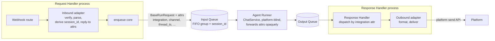

# #524: Pluggable request/response adapter for integrations

Introduce a pluggable **inbound (request) adapter** and **outbound (response) adapter** seam so webhook-based messaging integrations (Slack, WhatsApp, Messenger, Instagram, Telegram, Teams) run through the existing two-SQS-queue pipeline instead of executing the agent synchronously inside their webhook handlers. The inbound adapter normalizes a platform event into a `BaseRunRequest` + a reply-to context and enqueues it; the Agent Runner stays platform-agnostic; the outbound adapter delivers the reply back to the platform. The one design idea: **platform-specific concerns live only at the two adapter seams; everything between them is unchanged and platform-blind.** Gmail (polling-based) is deferred — see Non-goals.

## Motivation

- Integrations today are synchronous and bypass the queue entirely.
  - The only shared contract is `RESTRequestHandler`, an ABC whose single abstract method is `get_router()` (`ak-py/src/agentkernel/api/handler.py:15-17`) — there is no shared seam for parse / session-derivation / send.
  - Each handler parses inbound, runs the agent, and sends the reply inline in one class via `AgentService` directly (e.g. Slack `service.select(session_id=thread_ts, …)` + `run_multi` in `integration/slack/slack_chat.py:125,152`; WhatsApp in `integration/whatsapp/whatsapp_chat.py:286,292`). Inbound parsing and outbound sending are coupled.
  - No integration routes through the queue pipeline.
- Every integration already derives `session_id` as a deterministic natural key from platform conversation identity — we are formalizing existing behavior, not inventing it:
  - Slack `thread_ts` (`integration/slack/slack_chat.py:71,125`)
  - WhatsApp `from_number` (`integration/whatsapp/whatsapp_chat.py:276,286`)
  - Messenger `sender_id` (`integration/messenger/messenger_chat.py:193,202`)
  - Instagram `sender_id` (`integration/instagram/instagram_chat.py:211,221`)
  - Telegram `str(chat_id)` (`integration/telegram/telegram_chat.py:183,190`)
  - Teams `conversation.id` (`integration/teams/teams_chat.py:141`)
  - Gmail `thread_id or sender` (`integration/gmail/gmail_chat.py:265,411,421`) — Gmail is out of scope for this change (see Non-goals) but is included here to show the pattern is universal across all 7 integrations.
  - These keys are **bare** (e.g. a raw phone number or thread ts) — kept bare in this change; see session_id resolution.
- Today, `ServerlessAgentRunner`/`ECSAgentRunner` only special-case forwarding for `endpoint_url` (`serverless/akagentrunner.py:53-54,83-85`); carrying any other reply-routing attribute through the pipeline would otherwise require subclassing the runner per integration, and dispatching a reply per platform would otherwise require subclassing `ResponseHandler`/`ECSOutputConsumer` per integration — both gaps this change closes generically (see Queue routing and async delivery).
- The queue pipeline the integrations should reuse already exists and is proven for REST/WebSocket clients.
  - Request Handler (`deployment/common/queue_request_handler.py`) requires a client-supplied `session_id` (400 if missing, `:70-71`), mints a correlation `request_id = str(uuid.uuid4())` (`:76`), enqueues with FIFO `message_group_id = session_id` and `message_deduplication_id = request_id` (`:83-88`). It bypasses `ChatService` — no agent validation here (`:8-12`).
  - Agent Runner (`deployment/aws/containerized/akagentrunner.py:98`, `deployment/aws/serverless/akagentrunner.py:120`) runs `ChatService.process_chat_request(req)` and forwards `request_id`/`user_id` + FIFO ids to the output queue. It never creates a `session_id`.
  - Output side stores by `request_id` (`akoutputconsumer.py:99-107`) or broadcasts.
- The **WebSocket async path is already a prototype of this adapter pattern** and is the model to generalize.
  - Inbound stashes `endpoint_url` on the message as a custom SQS attribute (`serverless/core/router/ws_lambda.py`); the Agent Runner forwards it opaquely to the output queue as a `CustomAttribute` (`serverless/akagentrunner.py:53-54,83-85`).
  - `ResponseHandler` delivers out-of-band via `_broadcast_via_websocket(...)` using `endpoint_url` + `user_id`, with no ResponseStore polling (`serverless/akresponsehandler.py:60-91,106-109`); ECS mirrors this in `akoutputconsumer.py:110-131`.
- `ChatService` validates `session_id` inconsistently: the sync path checks `req.session_id is None` (`core/chat_service.py:488`) so `""` slips through, while the async/stream paths use `if not session_id` (`:366,401,450`).
- Integration config sections already exist for 6 platforms (`core/config.py:602-607`); **Teams has no config section** and Gmail's is polling-shaped (`token_file`, `poll_interval`, `label_filter`).

## Design overview

## Requirements

### Adapter abstractions

- Define an **inbound adapter** responsibility set (framework-agnostic, under `integration/` or a new `integration/adapter/` package; core must not import it):
  - Verify the raw platform event (signature / challenge) — it must receive the raw request (headers + body), since verification needs them.
  - Parse the event into a `BaseRunRequest`, mapping platform identifiers into the model's **standard fields** (`prompt`, `attachments`, `agent` from the integration's config, `user_id`) rather than inventing ad-hoc extra fields (e.g. map Slack's user into `user_id`, not a custom `slack_user_id`).
  - Derive the `session_id` (see session_id section).
  - Derive the `request_id`: **prefer the platform's own idempotency identifier when the platform provides one** (e.g. Slack `event_id` / `client_msg_id`), falling back to a minted `uuid4` only when no such identifier exists. This makes SQS FIFO dedup collapse platform-level webhook retries instead of causing duplicate agent runs.
  - Produce the reply-to attributes the outbound adapter needs to address the reply (see Queue routing and async delivery).
  - Separate "acquire the raw event" (the webhook route) from the shared "normalize → enqueue" core, so the normalization core is not tangled with FastAPI routing — this also keeps the door open for a non-webhook (polling) source later without redesigning the core (see Non-goals: Gmail is deferred, not designed for, in this change).
- Define an **outbound adapter** responsibility set:
  - Given the agent reply payload + the `reply_to` context, format the platform-specific message (including length chunking) and deliver it via the platform API.
- A given platform's inbound and outbound adapters are paired under one `integration` name (e.g. `"slack"`).
- Adapter selection follows the **house factory pattern** (`core/util/factory.py`): built-in short names resolved by `if/elif` + real imports, with a dotted-path bring-your-own branch — consistent with the guardrail / sandbox / store factories.

### session_id resolution

- The **inbound adapter resolves `session_id`** (Request Handler side), never the Agent Runner.
- `session_id` keeps each platform's **current, bare** derivation — no namespacing/prefixing in this change (e.g. Slack stays `thread_ts`, WhatsApp stays `from_number`, unchanged from today's `integration/*/*.py` logic). Namespacing to avoid cross-platform/cross-workspace key collisions is tracked as a separate, later CR.
- `session_id` continues to double as the SQS FIFO `message_group_id`, giving per-conversation ordering and serialized processing of concurrent turns of one conversation.
- Because the key is deterministic, redelivery under SQS at-least-once semantics reuses the same session (idempotent) rather than forking a new one.
- `request_id` remains the per-message correlation/dedup id, derived at the inbound edge (see Adapter abstractions for the platform-native-id-first rule); it is not the session key.

**Why the Request Handler side, not the Agent Runner:**

- **Platform conversation identity only exists at the edge.** `session_id` is a function of the raw webhook payload (Slack `thread_ts`, WhatsApp `from_number`, …); the Agent Runner never sees that payload, only the already-normalized `BaseRunRequest`. Resolving it at the inbound adapter keeps the runner's `ChatService` contract identical for every caller (REST, WebSocket, every integration) — it never needs platform-specific knowledge.
- **FIFO grouping must be known at enqueue time, not after dequeue.** `session_id` is also the SQS FIFO `message_group_id`, which SQS uses to serialize ordering. That value has to be attached to the message *before* it enters the queue; the Agent Runner runs strictly after dequeue, too late to influence which FIFO group the message already landed in.
- **Idempotency under at-least-once delivery.** SQS redelivers on visibility-timeout expiry or consumer failure. Because the inbound adapter's derivation is deterministic (same webhook payload → same `session_id` every time), a redelivered message reuses the same session instead of forking a new one. If the Agent Runner minted the id per processing attempt instead, each redelivery would create a distinct session for what is really one conversation turn.
- **Reply-routing symmetry.** The reply-to attributes (e.g. `channel`, `thread_ts`) are captured at the same inbound edge as `session_id`, from the same payload. Keeping both derivations in one place means the conversation identity and the "where to reply" identity are always consistent, instead of split across two components that could disagree.
- **Smallest change, matches the existing contract.** The Request Handler already requires a non-empty `session_id` before enqueue (`queue_request_handler.py:70-71`), and the Agent Runner already assumes one is present on every message it processes. Resolving it at the inbound adapter satisfies that existing contract directly — no change to `ChatService`, `AgentService`, or the Agent Runner's session handling is needed.

### Queue routing and async delivery

- Integrations are **queue-only with async delivery**:
  - The inbound adapter verifies, normalizes, enqueues to the Input Queue, and acks the platform (HTTP 200) immediately — it does not wait for the agent.
  - **Every integration reply is dual-written**: delivered to the platform via the outbound adapter, **and** written to the Response Store. This gives an audit trail / GET-polling fallback for every integration reply, at the cost of one store write per reply. This is a deliberate divergence from the WebSocket async path, which does not write to the store.
- The **reply-to context rides with the message as individual flat SQS custom attributes**, not a combined JSON blob (e.g. Slack: `channel`, `thread_ts`; WhatsApp: `to_number`), alongside the existing `request_id`/`user_id`. Each integration's inbound adapter declares the small set of named attributes its outbound adapter needs, plus an `integration` name attribute identifying which adapter pair handles the message.
- **The Agent Runner forwards `integration` and the declared reply-to attributes generically and opaquely**, for any attribute set an inbound adapter attaches — not hardcoded per platform. Today only `endpoint_url` gets this treatment (`serverless/akagentrunner.py:83-85`); any other reply-routing attribute currently requires subclassing the runner per integration. After this change, no runner subclassing is needed to add a new integration. Its `ChatService` contract is unchanged.
- **The Response Handler / `ECSOutputConsumer` gains a built-in adapter-dispatch lookup** keyed by the `integration` attribute, generalizing `_broadcast_via_websocket`: no per-product subclass should be needed to add a new integration — the outbound adapter is resolved from the registry and handed the reply payload + reply-to attributes, then the reply is also written to the Response Store (see dual-write above).
- The enqueue core currently inside `QueueRequestHandler.get_router` is factored out so both the generic `/api/v1/chat` route and integration inbound adapters share one enqueue path, instead of each integration hand-rolling its own SQS send.

### ECS vs Lambda placement

- Inbound adapter runs in the **Request Handler process**: the ECS IO container REST thread, or the request/integration Lambda behind API Gateway.
- **Route registration differs by hosting mechanism, feeding the same shared normalize→enqueue core**: ECS mounts the webhook route via `RESTRequestHandler`/`APIRouter` (FastAPI); Lambda registers it via `Lambda.register(route, method=...)` (Lambda-native routing) — no `APIRouter` involved on that side.
- Outbound adapter runs in the **Response Handler process**: the ECS IO container output-consumer thread (`ECSOutputConsumer`), or the `ResponseHandler` Lambda.
- The same adapter classes (normalize/enqueue core, outbound format/deliver) are reused across both deployment modes; only the hosting and route-registration mechanism differs.

### Migration

- The adapter path **replaces** the current synchronous handlers for the 6 webhook-based integrations — it is not an additional opt-in mode.
- Each `Agent<Platform>RequestHandler`'s inline parse/session/send logic is migrated into that platform's inbound + outbound adapter pair; the synchronous in-handler `AgentService.run_multi(...)` call inside the webhook handler is removed once the adapter path covers the platform.
- Slack, WhatsApp, Messenger, Instagram, Telegram, and Teams migrate in this change; none are left on the old synchronous path. Gmail is deferred (see Non-goals) and keeps its current polling implementation unchanged.

### Multiple integrations per deployment

- A single Request Handler / Response Handler process **may host multiple active integrations concurrently** (e.g. Slack + WhatsApp in one deployment) — not one integration per deployment.
- The adapter registry resolves the correct inbound/outbound adapter per request via the `integration` name carried on the message (a webhook route is mounted per active integration).

### Configuration

- Each integration keeps its existing config section (`core/config.py:602-607`); the adapter reads the agent name and platform credentials from it.
- A mechanism selects which integrations are active in a deployment (adapter registry keyed by the `integration` name).
- Any new knobs go through `AKConfig`.

### Cleanup

- Make `ChatService` `session_id` validation consistent across sync/async/stream (reject empty as well as `None`), so a well-formed non-empty `session_id` is guaranteed downstream (`core/chat_service.py:488` vs `:366,401,450`).

## Non-goals

- No change to the Agent Runner's `ChatService` execution contract or to the core `Session`/`Runtime` abstractions.
- No change to the generic REST/WebSocket client paths beyond factoring out the shared enqueue core.
- No new messaging platforms; only the 6 webhook-based integrations move to the adapter model.
- **Gmail is out of scope for this change.** It is polling-based, not webhook-based (`integration/gmail/gmail_chat.py:23,121` — no base class, `start_polling()` loop), which needs a poller-hosting story (ECS peer thread vs. Lambda EventBridge enqueuer) and a checkpoint store (e.g. `historyId`) that don't exist yet and aren't designed here. Gmail keeps its current synchronous polling implementation unchanged; adding it is a follow-up once a poller/checkpoint design exists.
- No streaming (token-delta) delivery to integration platforms in this change.

## Resolved questions

- **Namespacing**: deferred to a separate CR — `session_id` keeps each platform's current bare format in this change.
- **Reply-to size**: resolved as small, flat, named SQS attributes per platform (not a JSON blob) — well within SQS attribute limits for Slack in production use. Exact attribute names per platform (WhatsApp, Messenger, Instagram, Telegram, Teams) are a `spec.md` detail; none of their reply-addressing identifiers (numbers, ids, conversation refs) are expected to exceed a single SQS attribute.
