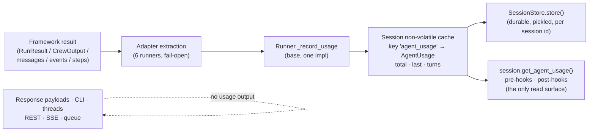

# #525: Track per-run and per-session usage metrics for every framework adapter

Every supported framework already hands its runner a result object carrying token/request usage, and every
runner throws it away. This change extracts usage in each of the six adapters, normalizes it into one
framework-agnostic `AgentUsage` object holding both the **cumulative** session totals and the **last run's**
usage, keeps it in the session's **non-volatile cache** under the reserved key `agent_usage` so it survives
every turn of the session, and exposes it to application code through a dedicated `Session` accessor for
pre-hooks and post-hooks. That accessor is the **only** read surface: no usage appears in any response
payload, in the CLI, or in the thread history.

**Citations**: `core/base.py`, the six framework runners and `trace/langfuse/langgraph.py` are cited against
`develop` *including the per-run framework-context plumbing* (`Session.get/set/clear_framework_context`,
`Runner._load_framework_context` / `_store_framework_context`, the collapsed Langfuse LangGraph runner);
all other files are cited against `develop` as-is.

## Motivation

- **Nothing in AK records usage today.** A repo-wide grep for `usage` over `ak-py/src` returns a single
  unrelated docstring URL (`core/util/config_yaml_util.py:149`). There is no model, no session key, no
  accessor, and no config surface.
- **Each runner discards a result object that already carries usage** — the data is one attribute away in
  all six adapters:
  - **OpenAI**: `reply = (await Runner.run(agent.agent, input_data, session=..., context=incoming)).final_output`
    (`framework/openai/openai.py:185`) — the `RunResult` (holder of `context_wrapper.usage`) is discarded on the
    same line. `agents.usage.Usage` carries `requests`, `input_tokens`, `output_tokens`, `total_tokens`,
    `input_tokens_details.cached_tokens`, `output_tokens_details.reasoning_tokens`
    (verified in the installed `agents/usage.py`, `openai-agents>=0.6.5`). Streaming has the same shape via
    `Runner.run_streamed(...)` (`openai.py:220`).
  - **Pydantic AI**: `result` *is* kept — for message history only (`framework/pydanticai/pydanticai.py:152-155`)
    — while `result.usage` (a **property**, not a method, in `pydantic-ai-slim~=2.13.0`) is never read.
    `RunUsage` exposes `input_tokens`, `output_tokens`, `requests`, `tool_calls`, `cache_read_tokens`,
    `cache_write_tokens` and a computed `total_tokens` (verified by introspection).
  - **CrewAI**: `reply = await crew.kickoff_async(inputs={})` (`framework/crewai/crewai.py:386`) — `CrewOutput`
    declares `token_usage` (`crewai.types.usage_metrics.UsageMetrics`: `total_tokens`, `prompt_tokens`,
    `cached_prompt_tokens`, `completion_tokens`, `reasoning_tokens`, `cache_creation_tokens`,
    `successful_requests`; verified against `crewai 1.15.7`), and only `raw`/`pydantic`/`json_dict` are read.
  - **LangGraph**: `result["messages"][-1]` is read for text only (`framework/langgraph/langgraph.py:412`);
    `AIMessage.usage_metadata` (`input_tokens`, `output_tokens`, `total_tokens`, plus optional token details —
    verified in `langchain_core.messages.ai`) is dropped, for every AI message the turn produced.
  - **Google ADK**: `get_response(...)` returns only `response_text` and drops each `Event`
    (`framework/adk/adk.py:193-219`). `Event.usage_metadata` is a
    `types.GenerateContentResponseUsageMetadata` (`prompt_token_count`, `candidates_token_count`,
    `total_token_count`, `cached_content_token_count`, `thoughts_token_count`; verified against
    `google-adk 2.5.0`).
  - **Smolagents**: `reply = await asyncio.to_thread(agent.agent.run, prompt, **run_kwargs)`
    (`framework/smolagents/smolagents.py:163`). `agent.monitor.get_total_token_counts()` returns
    `TokenUsage(input_tokens, output_tokens, total_tokens)` and every memory step carries `step.token_usage`
    (verified against `smolagents 1.26.0`) — neither is read.
- **The session's non-volatile cache is already the durable, cross-turn store for data outside the agent
  context** — exactly what `Session`'s own docstring describes it as (`core/base.py:29-32`), reached through
  `get_non_volatile_cache()` (`core/base.py:153-158`) and backed by `KeyValueCache`
  (`core/util/key_value_cache.py:8`, `set`/`get`/`delete`/`has`/`clear`). It is persisted with no new
  plumbing: `store()` runs after post-hooks (`core/runtime.py:218`), `Session.get_all` includes every
  non-volatile top-level key — `nv_cache` among them — and values are pickled
  (`core/session/serde.py:24`, `:36`).
- **Reserved keys already have named accessors** — `get_volatile_cache()` / `get_non_volatile_cache()` /
  `get_framework_context()` (`core/base.py:151`, `:158`, `:165`) — so usage should be reached the same way
  instead of making every caller spell a cache key.
- **Hooks are already the surface where AK hands application code the session** around a run —
  `PreHook.on_run(session, agent, requests)` (`core/hooks.py:21`) and
  `PostHook.on_run(session, requests, agent, agent_reply)` (`core/hooks.py:51`) — so a `Session` accessor is
  all that application code needs to read usage; no change to the reply models or the transports is required.

## Requirements

### Models (core, framework-agnostic)

Two Pydantic models in `core/model.py`, both exported from `agentkernel.core` (`core/__init__.py:15`).
Pydantic models pickle cleanly, so both are safe as session values.

- **`UsageMetrics`** — one measurement (one run, or one cumulative bucket). All fields `int`, default `0`:
  - **Parity fields** (the four the issue names): `requests`, `input_tokens`, `output_tokens`, `total_tokens`.
  - **Optional detail fields**, populated only where the framework reports them: `cached_input_tokens`,
    `reasoning_tokens`, `tool_calls`.
  - `framework: str | None` — the value of the recording runner's `name` property (`Runner.name`, e.g.
    `"openai"`, `"langgraph"`), so a session that ran more than one framework stays interpretable. On a
    cumulative bucket it is kept only while every contribution agrees, otherwise `None`.
  - **Accumulation is a method on the model**, not a free function: `UsageMetrics.add(other) -> UsageMetrics`
    returns a new instance with field-wise sums.
  - **`total_tokens` rule**: use the framework's own total when it reports one (all six do); otherwise
    `input_tokens + output_tokens`. Never recompute a framework-reported total, so provider-side accounting
    (e.g. ADK's `total_token_count`, which includes thought tokens) is preserved as reported.
- **`AgentUsage`** — the single object stored under the reserved key, carrying **both** cumulative and
  last-run usage so one read answers both questions:
  - `total: UsageMetrics` — cumulative over the session's lifetime.
  - `last: UsageMetrics | None` — the most recent run that reported usage; `None` until one does.
  - `turns: int` — count of runs that reported usage (**not** total runs: a run that reports nothing does not
    increment it). Documented as such, since the two differ.
  - **No per-agent breakdown.** *(Decision.)* There is no `by_agent` map: a session that runs several agents
    gets one set of totals. This keeps `AgentUsage` **fixed-width** — every field is a scalar or a single
    `UsageMetrics` — so the pickled session payload cannot grow with the number of agents, and
    `framework` on each `UsageMetrics` remains the only provenance signal.
  - `record(metrics) -> None` — the one place `total`, `last` and `turns` are updated together, so no caller
    can update them inconsistently.
- **Absent ≠ zero**: when a framework reports no usage for a run, **nothing is recorded** — `last` keeps its
  previous value and `turns` does not move. A zero-filled measurement must never be presented as a measured
  "0 tokens".

### Session surface — stored in the non-volatile cache

- **Storage location: the session's non-volatile cache**, under the reserved cache key `agent_usage`:
  `session.get_non_volatile_cache().set("agent_usage", <AgentUsage>)`. Not a top-level session data key, and
  never the volatile cache (which `Runtime` clears at the end of every run — `core/runtime.py:221`, `:259`).
  - The reserved name lives in the existing `Session.Keys` enum as `AGENT_USAGE = "agent_usage"`
    (`core/base.py:39-46`), with its docstring stating that this one names a key **inside** the non-volatile
    cache rather than a top-level session key — one obvious home for every reserved name.
  - Consequence to accept: the non-volatile cache is otherwise application-owned space, so `agent_usage` is
    a name application code must not reuse. It is documented as reserved, and the accessors below are the
    supported path.
  - `AgentUsage` is a Pydantic model, so it satisfies both the pickle path used by `SessionStore` and
    `KeyValueCache`'s documented "serializable values" contract (`core/util/key_value_cache.py:9-13`).
- **Accessors on `Session`**, mirroring the existing reserved-key accessor shape (`core/base.py:151-195`) —
  callers never spell the cache key or reach into the cache for this:
  - `get_agent_usage() -> AgentUsage` — returns the live stored object, **auto-creating and storing an empty
    `AgentUsage` in the non-volatile cache on first access**. This deliberately differs from
    `get_framework_context()`'s never-auto-create rule: for counters, "absent" and "all zero" mean the same
    thing, so materializing it on read cannot lose information. Never returns `None`, so hook code needs no
    null check.
  - `clear_agent_usage() -> None` — replaces the cache entry with a fresh empty `AgentUsage`.
  - Keeping the storage location behind these two methods is what makes it an implementation detail: moving
    usage to a different backing store later touches `Session` only.
- **Scope: pre-hooks and post-hooks** (plus any code holding the session, e.g. via `AgentService.session` or
  `ToolContext.get().session`). The read semantics differ by position and must be documented:
  - **Pre-hook** — `total`/`turns` cover the runs *before* this one; `last` is the previous run's usage
    (`None` on the session's first turn). Usable for budget/quota gating before the agent runs.
  - **Post-hook** — the current run is already recorded (the runner records before returning to
    `Runtime.run`, which then invokes post-hooks at `core/runtime.py:211-216`), so `last` is **this** run's
    usage and `total` includes it.
- **Durability**: the non-volatile cache is persisted by `store()` (`core/runtime.py:218` for `run`, `:256`
  for `stream`) and reloaded on the next turn, so totals accumulate across turns, across processes, and
  across deployments for **that session id**.
- **Reach is per-session, not cross-session — stated plainly.** The non-volatile cache is a member of one
  `Session`, so usage recorded under session A is not visible from session B; what it buys over the volatile
  cache is survival across *turns and processes* of the same session. Aggregating a user's or tenant's usage
  across sessions needs a store keyed by something other than `session_id` — see open question 1, which
  proposes the concrete follow-up rather than half-solving it here.
- `Session.clear()` clears the non-volatile cache in place (`core/base.py:188-189`), so it **drops usage**
  along with all other application cache data — meaning the CLI `!clear` (`cli/cli.py`, the `!c`/`!clear`
  branch) resets session usage. *(Decision, stated because it is observable.)*
- **No per-turn history list.** `AgentUsage` is fixed-width; a growing per-turn list would be unbounded in
  long-lived sessions and is pickled on every `store()`.

### Base `Runner` plumbing (one implementation, six call sites)

- Add to the base `Runner` (`core/base.py:228`), next to the framework-context helpers:
  - `_record_usage(session, metrics) -> None` — the single seam that resolves `session.get_agent_usage()`
    (which materializes the non-volatile cache entry if needed) and calls `record(metrics)`. No-op when
    `session` is `None` or `metrics` is `None`. Because the object is stored by reference in the cache,
    mutating it in place is what makes it persist — no re-`set` needed, and no other component writes that
    entry.
  - `_usage_failure(session, error) -> None` — logs an extraction/recording failure at WARNING with the
    session id and returns.
- **Fail-open, the deliberate inverse of the framework-context write-back policy.** Every adapter wraps its
  extraction and `_record_usage` call in `try/except Exception` → `_usage_failure(...)`. Usage is telemetry: a
  provider that changes a usage field's shape must not turn a completed agent run into an error reply,
  whereas a lost framework context silently corrupts application state.
- **Placement**: immediately after the native call returns, inside each adapter's existing `try` — the same
  seam as the framework-context write-back. **Only a successful run records usage.** *(Decision.)*
  Consequences, stated plainly:
  - A run whose framework call raises records **no** usage, even though tokens were spent — no best-effort
    recovery from SDK error objects, so the rule is identical on all six adapters rather than true for the two
    SDKs that expose partial usage on their exception path.
  - A run halted by a pre-hook (`core/runtime.py:202-204`) never reaches a runner, so it records nothing —
    and that path returns before `store()`, so nothing is persisted either.
- **`Runtime` needs no change.** The runner records into the session; `Runtime.run` / `Runtime.stream` already
  persist it via `store()`. Nothing is attached to replies or chunks (see the surface decisions below).
- Each adapter implements only its own extraction (table below) and calls `_record_usage`.

### Per-framework extraction

| Framework | Source (run) | Source (stream) | `requests` | Fidelity |
|---|---|---|---|---|
| OpenAI | keep the `RunResult` at `openai.py:185` instead of discarding it; read `result.context_wrapper.usage` | `RunResultStreaming.context_wrapper.usage`, read after `stream_events()` drains (`openai.py:220-225`) | SDK-reported | **Full** — incl. `cached_tokens` → `cached_input_tokens`, `reasoning_tokens` |
| Pydantic AI | `result.usage` (property → `RunUsage`) at `pydanticai.py:152` | `result.usage` inside the `async with agent.agent.run_stream(...)` block, after the delta loop (`pydanticai.py:197-203`) | SDK-reported | **Full** — incl. `cache_read_tokens` → `cached_input_tokens`, `tool_calls` |
| CrewAI | `reply.token_usage` at `crewai.py:386` (`prompt_tokens`→input, `completion_tokens`→output, `cached_prompt_tokens`→`cached_input_tokens`, `reasoning_tokens`) | n/a — `stream()` raises `NotImplementedError` (`crewai.py:411-417`) | `successful_requests` | **Full for the crew** (all agents/tasks in the kickoff) |
| Google ADK | sum `event.usage_metadata` over the events drained in `get_response` (`adk.py:205-219`): `prompt_token_count`→input, `candidates_token_count`→output, `total_token_count`→total, `cached_content_token_count`→`cached_input_tokens`, `thoughts_token_count`→`reasoning_tokens` | same summation over the SSE event loop (`adk.py:278-290`), **skipping `partial=True` events** | count of events carrying `usage_metadata` | **Full for the invocation**, sub-agents included (they emit on the same stream) |
| LangGraph | sum `usage_metadata` over the `AIMessage`s in `result["messages"]` **that this turn produced** — see the dedup rule below | sum usage from `on_chat_model_end` events while already iterating `astream_events` (`langgraph.py:447-459`) | count of AI messages / chat-model responses carrying usage | **Model-dependent** — see the streaming gap below |
| Smolagents | sum `step.token_usage` over the memory steps **added by this run** — see the delta rule below | n/a — `stream()` raises `NotImplementedError` (`smolagents.py:186-192`) | count of steps carrying `token_usage` | **Full for the run** |

- **LangGraph dedup rule (double-counting hazard).** `result["messages"]` is the graph's *checkpointed*
  history, not this turn's output — AK attaches a `CheckPointer` per session and appends exactly one
  `HumanMessage` per turn (`langgraph.py:355`, `:362`). Summing the whole list would re-count every previous
  turn on every turn. **Rule:** walk `result["messages"]` in reverse and stop at the last `HumanMessage`,
  summing only the `AIMessage`s after it. No extra graph round trip, and it is exact given AK's
  one-`HumanMessage`-per-turn invariant.
- **LangGraph streaming gap (honest limitation).** `astream_events` is used instead of a post-stream
  `aget_state(config)` read precisely because state carries the full history (same hazard). Usage on
  streamed responses depends on the chat-model integration emitting it (some require a
  `stream_usage`-style flag on the model the user constructs); when the events carry no usage, **nothing is
  recorded** rather than zeros. Documented, not worked around — AK does not mutate the user's model object.
- **Smolagents delta rule.** `agent.monitor` counters are **cumulative and only reset by `run(reset=True)`**,
  while AK deliberately passes `reset=False` (`smolagents.py:158`) — reading
  `monitor.get_total_token_counts()` would report the session's running total as this turn's usage. **Rule:**
  snapshot `len(agent.agent.memory.steps)` before the call and sum `token_usage` over the steps appended
  after it (`_sync_memory` already reads that list at `smolagents.py:166`).
  - **Known limitation**: the native smolagents agent object is shared across sessions, so concurrent runs of
    the same agent can interleave step appends. This is the same pre-existing exposure as memory
    hydrate/sync (`smolagents.py:97-124`); usage inherits it rather than adding a new one.
- **ADK plumbing change**: `get_response` (`adk.py:193`) currently returns `str`. Add a
  `run_events(...) -> tuple[str, UsageMetrics | None]` on `GoogleADKRunner` that owns the event loop and the
  summation, and reimplement `get_response` as a thin wrapper over it, so the existing public staticmethod's
  signature and behavior are unchanged for subclasses and callers.

### Surfaces deliberately **not** changed — no usage output anywhere

**Decision: the `Session` accessor is the *only* read surface.** Neither per-run nor cumulative usage is
printed, returned, or serialized by any AK-provided interface; application code that wants to expose it does
so itself from a hook or from the session it holds.

- **No usage in any response payload.** `ResponseBuilder.build_response`
  (`core/chat_service.py:278-303`) and `ResponseBuilder.stream_chunk` (`:306-317`) are untouched, so REST
  sync/async responses, SSE frames, WebSocket messages, and the queue bodies the ECS/serverless runners
  forward (`deployment/aws/containerized/akagentrunner.py:98,105`,
  `deployment/aws/serverless/akagentrunner.py:120`) are byte-for-byte unchanged.
- **No new field on the reply models or `StreamChunk`.** `AgentReplyText` / `AgentReplyImage` /
  `AgentReplyAny` (`core/model.py:90`, `:107`, `:127`) and `StreamChunk` (`:173`) stay as they are. Note that
  `ResponseBuilder.stream_chunk` emits `chunk.model_dump(exclude_none=True)` (`:314`), so a `StreamChunk`
  field would automatically have leaked into the stream payload — which is exactly what this decision
  excludes. The session accessor is the single read surface, and adding a reply-level field later stays
  additive if reply-object parity is ever wanted.
- **No usage on thread messages.** `ThreadMessage` (`core/thread/model.py:29-35`) is unchanged, since its
  contents are returned by `GET /api/v1/threads/{session_id}` — i.e. a response payload.
- **No new REST route** for reading session usage.
- **No CLI output and no CLI command.** `cli/cli.py` is unchanged — no `!usage` command, no per-turn usage
  line after a reply, and no usage in `help()`. *(Decision: the earlier draft proposed a `!usage` command;
  it is dropped, so "no usage output" holds for the developer surface too, not only for the API.)*
- **No usage in log output** beyond the existing debug logging of session data; nothing new is logged at
  INFO or above (a WARNING is emitted only when extraction itself fails).

### Documentation

- The docs must state the two things a reader cannot infer from the API shape:
  - **How to read it** — `session.get_agent_usage()` from a pre-hook or post-hook, with the position-dependent
    semantics of `last`/`total`/`turns` (pre-hook = before this run, post-hook = including it), and that this
    is the only surface: nothing appears in REST/SSE/queue responses or the CLI.
  - **What it excludes** — recorded usage counts only framework-reported LLM calls, so AK's own auxiliary
    calls (multimodal describe/analyse, thread auto-naming, LLM-backed guardrails) are **not** included and the
    numbers are a floor on the real token spend. *(Decision: do not count them; document the exclusion.)*
- Surfaces to update: `docs/docs/core-concepts/session.md` (accessor + semantics + exclusion caveat),
  `docs/docs/core-concepts/runner.md` (where extraction happens and the per-framework fidelity table), and the
  per-framework pages under `docs/docs/frameworks/` for the framework-specific caveats (LangGraph streaming
  gap, smolagents step-delta, ADK accumulate-only events). Dev skills `ak-dev-architecture` and
  `ak-dev-new-framework-integration` gain the new adapter obligation (a new framework adapter must extract
  usage), confirmed through the skills/docs sync flow before merge.

### Configuration

- **No new `AKConfig` section or toggle** (`core/config.py:590`). Collection reads objects the frameworks have
  already built and adds no network call, no LLM call, and no extra graph/session round trip on any adapter
  under the rules above; the per-run cost is a bounded loop over messages/events/steps AK already iterates or
  holds. Always-on also avoids the "why is usage empty?" support path that a default-off flag creates.

### Behavior / compatibility

- **Purely additive and invisible**: two new models, one reserved non-volatile-cache key, two new `Session`
  accessors, and per-adapter extraction. No existing signature changes (including ADK's `get_response`), no
  payload changes, no CLI changes, no config changes — an application that never calls `get_agent_usage()`
  cannot observe this change except through the session's stored size.
- **Data compatibility**: sessions persisted before this change unpickle with an `nv_cache` that has no
  `agent_usage` entry; the first `get_agent_usage()` materializes an empty one. Sessions written after the
  change are readable by older code, which simply ignores the extra cache entry.
- **Framework-reported usage only.** *(Decision.)* AK's own auxiliary LLM calls are **not** counted: the
  multimodal description/analysis calls (`core/multimodal/hooks.py`, `core/multimodal/tools.py`), thread
  auto-naming (`core/thread/naming.py`), and LLM-backed guardrail providers (`guardrail/`). Recorded usage is
  therefore a floor on the session's true token cost, not the whole bill — and that limitation is a
  documentation requirement, not a silent gap (see Documentation above).
- **Multi-agent scope follows the framework, with no per-agent split**: usage covers
  handoffs/sub-agents/graph nodes/crew members wherever the framework aggregates them into the run result (all
  six, per the table), and lands in one set of session totals. Usage of a *remote* agent reached over A2A is
  not included.
- **Traced runs keep usage**, because all 18 traced runners
  (`trace/{langfuse,openllmetry,logfire}/{openai,adk,crewai,langgraph,smolagents,pydanticai}.py`) delegate to
  `super().run(...)` and none overrides `stream()` (verified by grep). Requirement: a regression test
  asserting a traced run still records usage into the session, so a future traced runner that re-implements a
  native call fails a test instead of silently losing the feature.

## Non-goals

- **Per-tool-call usage attribution** (the issue's "persist usage per tool call"): no framework exposes a
  tool→token mapping AK could populate faithfully; usage is reported per LLM request, and the honest
  granularity is per run.
- **Any usage output** — REST, SSE, WebSocket, queue bodies, thread history, or the CLI. The `Session`
  accessor is the only read surface.
- **Cost/pricing**: no model price table, no currency amounts.
- **A new REST route** for session usage.
- **Counting AK's own auxiliary LLM calls** (multimodal, thread naming, guardrails) — excluded, and the
  exclusion is documented.
- **Best-effort usage from a failed run** — only a successful framework call records usage.
- **Per-agent attribution** within a session — one set of totals per session, no `by_agent` map.
- **A per-turn usage history** inside the session object.
- **Cross-session / per-user / per-tenant aggregation.** Usage is scoped to one session id; no store keyed by
  `user_id`, `group_id`, or tenant is introduced here (see open question 1).
- Changing how tracing providers report usage to their own backends (Langfuse/OTel usage attributes are
  produced by the providers' instrumentation, untouched here).
- Retro-filling usage for sessions that predate the change.

## Open questions

1. **How should usage be aggregated across sessions?** The non-volatile cache makes usage durable for a
   session id, but a user who starts a new session starts a new counter. Options, none of which this change
   implements:
   - **(a) Defer** to a follow-up issue — *proposed default*, keeps this change to the parity gap the issue
     describes.
   - **(b) Roll up on the existing thread surface**: thread support already keys durable state by
     `session_id` with `user_id`/`group_id` attached (`core/thread/model.py:38-56`), so a per-user total could
     be maintained by `ConversationThreadManager` — but it would only work when thread support is enabled.
   - **(c) A dedicated pluggable usage store** (a `UsageStore` keyed by `user_id`, following the
     `SessionStore`/`ThreadStore` backend-factory pattern) — the general answer, and a change of its own size:
     new config section, five backends, new read surface.
2. **Flat vs nested counters?** `AgentUsage` nests `UsageMetrics` for `total` and `last`, so reads are
   `usage.total.input_tokens` / `usage.last.input_tokens`. The alternative — flat cumulative fields plus
   `last_*` duplicates on a single class — reads shorter at the top level but duplicates every counter and
   makes "which fields are cumulative?" a naming convention rather than a type. *Proposed default: nested, as
   specified.* This shapes the API hooks call, so it is worth an explicit answer.

### Resolved

- **No usage output anywhere** — not in API responses and not in the CLI. Only `session.get_agent_usage()`.
  (Applied under "Surfaces deliberately not changed"; the previously proposed `!usage` CLI command is dropped.)
- **Only successful runs record usage** — a framework failure records nothing for that run, uniformly across
  adapters. (Applied under "Base `Runner` plumbing".)
- **AK's internal LLM calls are not counted**, and the exclusion is a documentation requirement. (Applied
  under "Documentation" and "Behavior / compatibility".)
- **No per-agent breakdown** — `by_agent` is dropped; one set of totals per session, which also makes
  `AgentUsage` fixed-width. (Applied under "Models".)
