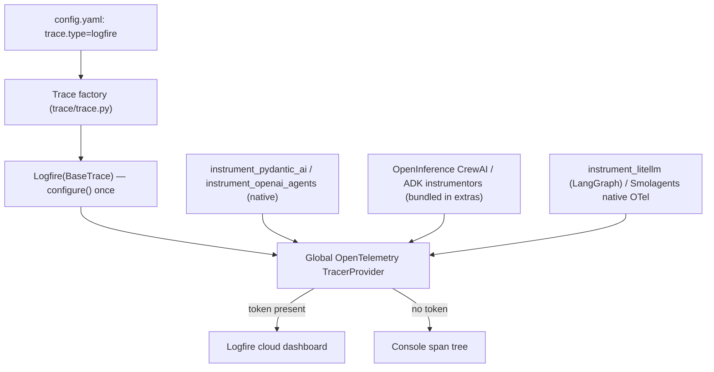

# #545: Evaluate and Integrate Pydantic Logfire as an Observability Provider

Adds Pydantic Logfire as a third built-in tracing provider (`trace/logfire/`), selectable with
`trace.type: logfire`, mirroring the `BaseTrace` + per-framework-runner shape of the existing
`langfuse` and `openllmetry` providers. Logfire's addition over the two existing providers is
first-class *native* Pydantic AI instrumentation and a zero-signup console fallback; the one design
idea is that `logfire.configure()` installs Logfire as the **global OpenTelemetry tracer provider**,
so the OpenInference instrumentors already bundled with the framework extras emit into it with no
new dependencies. The change is purely additive.

## Motivation

- AK ships two tracing providers today, both behind `BaseTrace` with one method per framework:
  `langfuse` and `openllmetry` (`trace/trace.py:8` `_BUILTIN_TRACERS = ["langfuse", "openllmetry"]`;
  `trace/base.py:7-54` declares `init` + six `@abstractmethod` framework methods).
  - Each framework `Module` already consumes tracing transparently via `Trace.get().<framework>()`
    when `trace.enabled` (e.g. `framework/pydanticai/pydanticai.py:315-316`) — so a new provider is
    reached with **no** change to any framework adapter.
- AK now ships a Pydantic AI adapter (#531). Logfire is built by the Pydantic team and gives
  Pydantic AI **native, first-class** instrumentation via `logfire.instrument_pydantic_ai()` — a
  richer, correctly-nested trace than routing Pydantic AI through a third-party span processor (the
  route `trace/langfuse/pydanticai.py:24-29` takes with `OpenInferenceSpanProcessor`).
- Logfire is OpenTelemetry-native. `logfire.configure()` registers Logfire as the process-global
  OTel tracer provider (verified: `opentelemetry.trace.get_tracer_provider()` returns a
  `logfire...ProxyTracerProvider` afterwards). Consequences:
  - The OpenInference instrumentors already declared in the `crewai`/`adk` extras
    (`CrewAIInstrumentor`, `LiteLLMInstrumentor`, `GoogleADKInstrumentor` — the same ones
    `trace/langfuse/crewai.py:5-6` and `trace/langfuse/adk.py:5` use) emit into Logfire for free.
  - No Logfire-native method exists for LangChain/CrewAI/ADK/Smolagents (verified against
    `logfire==4.38.0`: `instrument_pydantic_ai`, `instrument_openai_agents`, `instrument_litellm`
    exist; `instrument_langchain`/`_crewai`/`_adk`/`_smolagents` do not).
- Auto-detected destination is a genuine evaluation advantage: `send_to_logfire="if-token-present"`
  streams to the hosted dashboard when a credential is present and otherwise prints spans to the
  console — so tracing runs with **zero signup**, unlike `langfuse` (requires keys, and
  `LangFuse.init()` raises if `auth_check()` fails — `trace/langfuse/langfuse.py:20-28`) or
  `openllmetry` (needs a collector/endpoint).
- The trace factory is already the #541 pluggable-backend pattern (`require_extra`/`resolve_dotted`/
  `AKConfigError` from `core/util/factory.py`), so adding a built-in short name is a known,
  mechanical shape (`trace/trace.py:37-57`).

## Requirements

The existing `openllmetry` provider (`trace/openllmetry/`) is the closest structural template
(both are OTel-based; `openllmetry.py` configures once in `init()` and each runner wraps
`super().run()`), per `.agents/skills/ak-dev-new-tracing-provider`.

### Package layout and naming

- New provider package `ak-py/src/agentkernel/trace/logfire/`: `__init__.py` (re-exports `Logfire`),
  `logfire.py` (main class), and one traced-runner module per framework — `openai.py`,
  `langgraph.py`, `crewai.py`, `adk.py`, `smolagents.py`, `pydanticai.py`.
- Class names: `Logfire(BaseTrace)`; runners `Logfire<Framework>Runner` (e.g.
  `LogfirePydanticAIRunner`), each subclassing the framework's base `Runner`.
- Short name `logfire` used consistently for the directory, the `trace.type` value, and the
  pyproject extra — matching `langfuse`/`openllmetry` precedent (the AK short name, which here
  equals the import name `logfire`).

### `Logfire(BaseTrace)` main class

- Must implement all seven `BaseTrace` abstract methods (`init` + the six framework methods) — the
  class is otherwise not instantiable (`trace/base.py:7-54`).
- `init()` must configure the Logfire SDK **exactly once per process**, thread-safely.
  - Guard must be class-level, because `Trace.get()` builds a fresh provider instance on every call
    (`trace/trace.py:24-35`) — mirrors OpenLLMetry's `TraceloopContext._initialized` +
    `threading.Lock` (`trace/openllmetry/openllmetry.py:29-55`).
  - Configuration is `logfire.configure(service_name=..., send_to_logfire="if-token-present")`.
    - `send_to_logfire="if-token-present"` is the one non-default setting and is required: Logfire's
      own default (`None`) raises when no credential is configured, which would break local runs.
    - `service_name` defaults to `"AgentKernel"` (matches OpenLLMetry's `app_name="AgentKernel"`,
      `openllmetry.py:100`), overridable via `LOGFIRE_SERVICE_NAME`.
  - Must not pass `console=`, so Logfire honors its own `LOGFIRE_CONSOLE_*` environment variables
    (verified: `console=None` → env-driven) — no AK-invented console default.
  - Must pass `scrubbing=logfire.ScrubbingOptions(callback=...)` with a callback that allowlists the
    `session_id` span attribute — Logfire's default scrubber otherwise redacts it for matching the
    "session" pattern (verified). The callback returns the value only for the `session_id` key and
    `None` (default scrubbing) for everything else, so prompts/tool-args/tokens stay scrubbed. See
    Decisions.
- The six framework methods each return the matching `Logfire<Framework>Runner` (lazy import inside
  the method, mirroring `openllmetry.py:103-149`).

### Per-framework traced runners

- Each runner subclasses its framework's base `Runner`, instruments its framework in `__init__`, and
  wraps `super().run()` in `with logfire.span("Agent Kernel <Framework>", session_id=session.id)`,
  recording `input`/`output` attributes on the span (mirrors the langfuse runners' span shape).
- Instrumentation per framework (native where it exists; reuse the bundled OpenInference
  instrumentor otherwise; all emit into the global OTel provider Logfire installs):

  | Framework | Instrumentation | Source of the instrumentor |
  |---|---|---|
  | Pydantic AI | `logfire.instrument_pydantic_ai()` | Logfire-native |
  | OpenAI (Agents SDK) | `logfire.instrument_openai_agents()` | Logfire-native |
  | CrewAI | `CrewAIInstrumentor` + `LiteLLMInstrumentor` | bundled in the `crewai` extra |
  | Google ADK | `GoogleADKInstrumentor` | bundled in the `adk` extra |
  | LangGraph | `LangChainInstrumentor().instrument()` | OpenInference, added to the `langgraph` extra (model-agnostic) |
  | Smolagents | none (native OTel emission) + AK span | Smolagents' own OTel output |

### Factory registration (`trace/trace.py`)

- Add `"logfire"` to `_BUILTIN_TRACERS` and a `logfire` branch to `Trace._build()`, wrapping the
  lazy `from .logfire.logfire import Logfire` in `require_extra("logfire", "trace.type: logfire")` —
  identical shape to the `langfuse`/`openllmetry` branches (`trace/trace.py:41-50`).
- `logfire.py` must `import logfire` at **module top** (not lazily inside `init()`), so a missing
  SDK raises `ImportError` at the `_build()` import and `require_extra` converts it to the friendly
  `agentkernel[logfire]` message — matching how `langfuse.py`/`openllmetry.py` import their SDKs.

### Packaging (`ak-py/pyproject.toml`)

- Add a `logfire` optional-dependency group: `logfire>=4.0.0` (verified against `4.38.0`; the
  Logfire-native `instrument_*` methods used exist across 4.x).
- Add `openinference-instrumentation-langchain>=0.1.29` to the existing `langgraph` extra — LangGraph
  is model-agnostic and ships no bundled instrumentor, so its traced runner needs one (co-resolves
  with `langchain~=1.2.3` in the shared lock, verified). CrewAI/ADK reuse the OpenInference
  instrumentors already in their own extras; no other new instrumentor packages are needed.

### Configuration

- **No `config.py` change.** `_TraceConfig.type` is already a free-form `str` with default
  `"langfuse"` and no `pattern=` (`config.py:265-270`), so `trace.type: logfire` validates as-is;
  the #541 refactor deliberately removed the old regex to allow bring-your-own tracers.
- Enable with `trace: { enabled: true, type: logfire }` (or `AK_TRACE__ENABLED` /
  `AK_TRACE__TYPE`).

### Example

- Add `examples/cli/pydanticai-logfire/`, reusing the Pydantic AI demo agents from
  `examples/cli/pydanticai/` unchanged, with only a `config.yaml` (`trace.type: logfire`) added — so
  the example demonstrates that tracing is transparent to agent code. README documents the
  auto-detect (cloud vs console) flow.

### Tests

- Extend `ak-py/tests/test_trace.py` with a `logfire` missing-extra case (mirrors the langfuse/
  openllmetry cases at `:81-97`), and fix `_FakeTrace` there: it implements only the original five
  framework methods, so on any branch carrying #531's abstract `pydanticai()` on `BaseTrace`
  (this branch does) `test_trace_byo_dotted_path` cannot instantiate it — verified locally as
  `TypeError: Can't instantiate abstract class _FakeTrace without an implementation for abstract
  method 'pydanticai'`.
- Add `ak-py/tests/test_trace_logfire.py`: provider is a complete `BaseTrace`; `init()` configures
  with `send_to_logfire="if-token-present"` once; the Pydantic AI runner instruments on construction
  and wraps `run()` in the AK span. Gate on `pytest.importorskip("logfire")`.

### Docs

- Extend `docs/docs/advanced/traceability.md` with a Logfire section (install, config, auto-detect
  credentials, what gets traced, viewing) and add it to the supported-platforms list and summary.
  Add Logfire to the observability lines in `README.md`.

## Non-goals

- Changing any framework adapter, `BaseTrace`, or the two existing providers — the `pydanticai()`
  method is already abstract on `BaseTrace` (from #531), and every `Module` already calls
  `Trace.get().<framework>()`; the change is additive (new package + one factory branch + one extra).
- Adding an `AKConfig` surface for Logfire console verbosity / content capture — Logfire's own
  `LOGFIRE_CONSOLE_*` env vars and `instrument_pydantic_ai(include_content=...)` cover this; AK adds
  no second configuration surface (consistent with "wrap, don't abstract over").
- Adding a new OpenInference instrumentor dependency for Smolagents — it is covered by its native
  OTel output; introducing `openinference-instrumentation-smolagents` is out of scope. (LangGraph
  *does* gain `openinference-instrumentation-langchain` in its extra — see Requirements — because it
  is model-agnostic and a LiteLLM-only approach misses the common `ChatOpenAI`/langchain-openai path.)
- Self-hosting / OTLP-collector export configuration beyond what Logfire's own env vars provide.

## Decisions (resolved open questions)

- **`session_id` scrubbing → allowlist via callback; keep the `session_id` name.** Logfire's default
  scrubber redacts attribute values whose key matches a sensitive pattern; `session_id` matches
  `session`, so the attribute rendered as `[Scrubbed due to 'session']` (verified in console and the
  dashboard). Resolved by passing `scrubbing=logfire.ScrubbingOptions(callback=...)` where the
  callback returns the original value for the `session_id` attribute and `None` (default scrubbing)
  for everything else — verified un-redacting only that attribute while leaving all other scrubbing
  on. Chosen over renaming to a non-triggering key (e.g. `ak.conversation_id`) so the correlation
  attribute keeps the same `session_id` name the langfuse/openllmetry runners already use.
- **Version floor → `logfire>=4.0.0`.** Every Logfire API used (`instrument_pydantic_ai`,
  `instrument_openai_agents`, `instrument_litellm`, `ScrubbingOptions(callback=...)`) is present
  across the 4.x line (verified on `4.38.0`); anchoring to the current major mirrors the
  `langfuse>=4.2.0` style.
- **Console default → keep Logfire's own (console on), honor `LOGFIRE_CONSOLE_*`.** Per the adapter
  rule "same default the native tool itself would use" — and console-on is exactly the zero-signup
  evaluation path. Users silence/tune it via `LOGFIRE_CONSOLE=false` and the other `LOGFIRE_CONSOLE_*`
  variables; AK adds no `console=` argument and no `AKConfig` surface.
