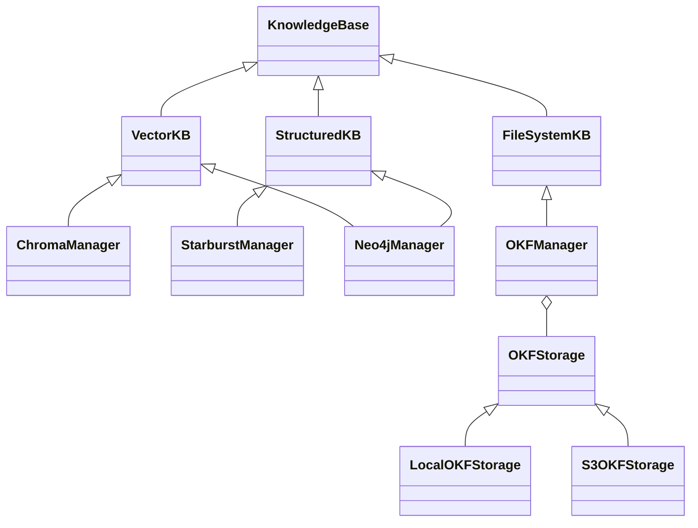

# #553: Open Knowledge Format (OKF) support via a typed KnowledgeBase hierarchy + per-instance dynamic tools

Splits the flat `KnowledgeBase` ABC into a typed hierarchy (`VectorKB` / `StructuredKB` / `FileSystemKB`), adds an OKF-aware backend (`OKFManager`) over a pluggable `OKFStorage` blob-store primitive (local disk, S3), and replaces `KnowledgeBuilder`'s fixed 4-tool surface with dynamically-named tools generated per registered backend **instance**, so the agent gets a distinctly-named, distinctly-shaped tool per knowledge source instead of routing through one generic `read_kb(backend, query)`.

OKF is Google's Open Knowledge Format (v0.2): a knowledge bundle is a directory of markdown files, one concept per file, with YAML frontmatter (only `type` is required) and markdown cross-links — see `research/okf-spec-summary.md` for the spec summary this design builds on.

## Motivation

- `KnowledgeBase` (`ak-py/src/agentkernel/knowledgebase/base.py:7`) is a flat ABC — all three existing backends subclass it directly with no capability distinction:
  - `ChromaManager(KnowledgeBase)` (`chroma.py:13`) — embedding/semantic search.
  - `Neo4jManager(KnowledgeBase)` (`neo4j.py:14`) — raw Cypher via `read(query, limit)`/`write(records)`.
  - `StarburstManager(KnowledgeBase)` — raw SQL via Trino.
  - The distinction between "search by meaning" (vector) and "search by query language" (structured) already exists implicitly in these three backends' behavior, but nothing in the type system expresses it.
- Neo4j deployments commonly combine a Cypher graph store with a vector index over the same database — the current single-parent hierarchy has no way to declare a backend as both.
- `KnowledgeBuilder.build()` (`knowledgebuilder.py:91-190`) exposes exactly **4 fixed tools** no matter how many backends are registered: `get_schemas`, `read_kb(backend, query, limit)`, `write_kb(backend, text, source, query, params_json)`, `get_all_kb_descriptions`. Backend selection is a free-form `backend: str` parameter the agent must get right from reading `get_schemas()` output — the LLM does routing via string matching, not via distinct tool signatures.
- `write_kb`'s single generic signature (`knowledgebuilder.py:132-167`) already shows the strain of covering three different backend shapes in one function: `text`/`source` for the vector store, `query`/`params_json` for Cypher (translated internally to `cypher_query`/`cypher_params` metadata, `knowledgebuilder.py:156-157`) and for SQL. Adding a file/bundle backend (path + content) to this same signature would make it worse, not better.
- No existing backend is path/blob-shaped — there is no way today to expose an OKF bundle (or any local/S3 file set) as a knowledge source. OKF's consumption model (progressive disclosure from `index.md`, agents both reading and writing bundle files — see `research/okf-spec-summary.md`) fits the KB-tools pattern directly.
- Knowledge bases are not config-driven today: `core/config.py` has no `knowledgebase` section (verified — no match for `knowledgebase`/`KnowledgeBase` in that file), and all three existing backends are constructed directly in user code (`examples/cli/knowledgebase/openai/multi/demo.py:22-169`).
- The pluggable-backend house pattern already exists and is reused across the codebase: `core/util/factory.py:26-64` (`resolve_dotted`, `require_extra`, `AKConfigError`) backs `SandboxProviderFactory` (`sandbox/factory.py:20,37` — built-in `if/elif` real imports + dotted-path bring-your-own) and `_MultimodalConfig.storage_type` (`config.py:191-217`).
- `boto3` is already an optional dependency via the existing `aws` extra (`ak-py/pyproject.toml:58-59`), currently used by the sandbox `ec2_ssm` provider — an S3-backed storage class needs no new extra.

## Requirements

### KnowledgeBase ABC refactoring — typed hierarchy

- Restructure the flat `KnowledgeBase` ABC into a parent + three capability children:
  - **Parent — `KnowledgeBase`** (`knowledgebase/base.py:7`): keeps the full shared surface exactly as today — abstract `connect`/`write`/`read`/`backend_name`/`get_description`, concrete `add_schema`/`schema`/`format_results`/`close` (`base.py:40-111`). No method is added, removed, or re-signatured on the parent.
  - **Child — `VectorKB(KnowledgeBase)`** — semantic/embedding-based search backends.
  - **Child — `StructuredKB(KnowledgeBase)`** — query-language backends (SQL, Cypher, ...).
  - **Child — `FileSystemKB(KnowledgeBase)`** — path-addressed file/bundle backends (new).
- The three children live in `knowledgebase/base.py` alongside the parent (they are part of the same contract, not separate backends) and are exported from the `knowledgebase` package alongside `KnowledgeBase`.
- Each child is a capability tag: **none widen the parent's abstract contract** — a backend subclassing a child implements the same five abstract members it does today. This is deliberate, not deferred:
  - Per-instance tool generation (below) derives tools from each backend's own concrete methods, so no code path ever invokes "any `VectorKB`" polymorphically — a per-type contract would have no caller.
  - The only uniform surface a generic consumer needs (`read(query, limit)`/`write(records)`) already lives on the parent; the children exist for classification (`isinstance` filtering, docs, schema generation).
  - Pure tags keep `Neo4jManager(VectorKB, StructuredKB)` a trivial diamond; two behavioral ABCs would immediately force disambiguated method names (does `read` mean Cypher or vector search?).
  - **Trigger rule for future contracts**: a capability child gains abstract members only when the first framework-side consumer appears that must call capability-specific behavior polymorphically — the visible candidates are the deferred OKF→`VectorKB` ingestion pipeline (a non-goal here, would need an upsert-shaped method) and a generic RAG pre-hook over all vector KBs (would need scored semantic search beyond `read(query, limit)`). When that day comes, prefer declarative members (e.g. `StructuredKB.query_language: str`) over operational ones, and note that adding abstract members is a breaking change for third-party subclasses already tagged with the child.
- Reclassify the three existing backends (declaration-only change; no behavior change to their `read`/`write` logic):
  - `ChromaManager(VectorKB)` (`chroma.py:13`)
  - `StarburstManager(StructuredKB)`
  - `Neo4jManager(VectorKB, StructuredKB)` — **multiple inheritance**: Neo4j genuinely has both vector-index and Cypher capability; MRO is a plain diamond back to `KnowledgeBase` since neither parent adds conflicting members.
- A backend may inherit from more than one capability child whenever it genuinely supports more than one access pattern (the Neo4j case above is the template).
- Compatibility: third-party backends that subclass `KnowledgeBase` directly keep working unchanged — the capability children are opt-in classification, and `KnowledgeBuilder` continues to accept any `KnowledgeBase` (it type-checks against the parent, `knowledgebuilder.py:11`).
- The new concrete backend is `OKFManager(FileSystemKB)` — named consistently with `ChromaManager`/`Neo4jManager`/`StarburstManager`. `FileSystemKB` stays an open tag so future non-OKF file backends can share it.



### OKFStorage — blob-store primitive

- New ABC, `OKFStorage`, under `knowledgebase/okf/storage/base.py`, with exactly this surface:

```python
class OKFStorage(ABC):
    """Minimal blob-store surface over bundle-relative POSIX paths."""

    @abstractmethod
    def read(self, path: str) -> str: ...        # raises OKFNotFoundError if missing

    @abstractmethod
    def write(self, path: str, content: str) -> None: ...

    @abstractmethod
    def list(self, prefix: str = "") -> list[str]: ...   # recursive, sorted, bundle-relative

    @abstractmethod
    def exists(self, path: str) -> bool: ...

    @abstractmethod
    def last_modified(self, path: str) -> Optional[datetime]: ...  # tz-aware; None if absent
```

  - Paths are always POSIX-style, bundle-relative, never start with `/`. (OKF's bundle-absolute link form `/tables/customers.md` is normalized to a bundle-relative storage path by `OKFManager`, not by the storage layer.)
  - `OKFStorage` is pure blob transport — it knows nothing about frontmatter, concepts, or conformance; all OKF semantics live in `OKFManager`.
  - `last_modified` exists solely so `OKFManager` can skip re-parsing files unchanged since its internal cache last saw them — **it is not** a hook for ingesting bundle content into another `KnowledgeBase` backend (explicitly out of scope, see Non-goals).
- Implementations:
  - `LocalOKFStorage` — root directory on local disk.
  - `S3OKFStorage` — bucket + key prefix, via `boto3` (already covered by the `aws` extra). Authentication uses the **default boto3 credential chain** (env vars, shared config/profile, IAM role) — no explicit credential constructor args; constructor takes `bucket`, `prefix`, and optional `region`.
- A missing path raises a new `OKFNotFoundError` (defined alongside `OKFStorage`, following the existing per-capability error hierarchy convention, e.g. `sandbox/errors.py`).

### OKFManager — the OKF semantic layer

One concrete class, `OKFManager(FileSystemKB)`, parametrized by an `OKFStorage` instance (composition — `LocalOKFStorage`/`S3OKFStorage` supply the difference; no `LocalOKFManager`/`S3OKFManager` subclasses). It implements OKF v0.2 semantics on top of the blob surface (spec details in `research/okf-spec-summary.md`):

- **Concept model**
  - Concept ID = bundle path minus the `.md` suffix (`tables/customers.md` → `tables/customers`); reads accept either form.
  - Reserved files `index.md` and `log.md` are never returned as concepts.
- **`read(query, limit)`** — `query` is an exact concept ID or bundle path (no glob/search; `list` + `read` covers browsing). Returns one `Record`: `text` = markdown body, `metadata` = parsed YAML frontmatter plus derived fields:
  - `concept_id`, `path`
  - `stale: bool` (from `stale_after`, per spec §5.5) and `status` (default `stable`) so the agent doesn't silently cite deprecated/stale knowledge
  - trust tier derived from `verified`/actor prefixes (`unverified` / `machine-confirmed` / `human-reviewed`)
  - `limit` is accepted for interface compatibility and ignored (0 or 1 records).
- **`write(records)`** — each record's `metadata["path"]` names the target; `text` is the document content. Writes are **conformance-validated**: the document must carry parseable YAML frontmatter with a non-empty `type` (spec §11) or the write is rejected with a readable error. On write, `OKFManager` stamps `generated: {by: <actor>, at: <ISO 8601>}` into the frontmatter when the field is absent. A record missing `metadata["path"]` is a write error.
  - The `generated.by` actor resolves in three levels, following the spec's actor convention:
    1. A constructor-supplied `actor: str` wins when given — the escape hatch for fixed deployment identities (e.g. `process:finance-nightly`), and the **only** way a `human:<id>` actor can appear (never auto-stamped, so trust tiers stay honest — agent-written concepts land in the machine tier until a person adds a `verified` entry).
    2. Otherwise, when the write happens inside an agent run: `<agent_name>/agentkernel-<version>` — the write tools execute within a `ToolContext` (`core/tool.py:89-100`), so `ToolContext.get().agent.name` is available exactly when the agent calls the write tool; matches the spec's `<producer>/<version>` form. The agentkernel package version is used (not the underlying model ID, which AK cannot reliably know across frameworks).
    3. Otherwise (direct programmatic write, no `ToolContext`): `process:agentkernel/<version>`.
  - Optional `read_only=True` constructor flag makes `write` raise `NotImplementedError` (the existing read-only convention, cf. Starburst) for bundles that must stay agent-immutable. Default is writable — OKF explicitly expects agent writes.
- **Progressive disclosure** — an `index()` method returns the bundle-root `index.md` body when present, otherwise a listing **synthesized** from concept frontmatter (`* [title](path) - description`), which the spec explicitly permits. This is the agent's intended entry point into a bundle.
- **`list(prefix)` / `exists(path)` / `last_modified(path)`** — exposed beyond the `KnowledgeBase` contract (delegating to storage), with `list` returning concept entries (`concept_id`, `type`, `title`, `description`) rather than bare paths.
- **Spec-mandated tolerances** (MUST rules, §11): never validate or follow the cross-link graph (broken links are legal); tolerate unknown `type` values and unknown frontmatter keys, and preserve unknown keys byte-for-byte when rewriting a document; normalize a bare `verified` mapping to a single-element list; tolerate a missing `index.md`; attempt best-effort consumption when `okf_version` (bundle-root `index.md` frontmatter) is newer than 0.2.
- **Self-describing schema** — `schema()` auto-populates from the bundle (`okf_version`, top-level index sections, concept-type inventory) when the user has not called `add_schema()`; an explicit `add_schema()` still overrides. This removes the manual-schema burden the other backends carry (`examples/cli/knowledgebase/openai/multi/demo.py:29-44`) because an OKF bundle is self-describing by design.
- Frontmatter parsing uses YAML; `pyyaml` is already a core dependency (used by `AKConfig`), so no new required dependency.

### KnowledgeBuilder — per-instance dynamic tools

- Replace the fixed `read_kb(backend, query, limit)` / `write_kb(backend, ...)` pair with tools generated **per registered backend instance**, dynamically named and typed from that backend's own methods.
  - Example: registering `ChromaManager(name="ChromaDB")` and `OKFManager(name="Docs", storage=LocalOKFStorage(...))` produces `read_ChromaDB(query, limit)`, `write_ChromaDB(text, source)`, `index_Docs()`, `read_Docs(concept)`, `write_Docs(path, content)`, `list_Docs(prefix)` — distinctly-named, distinctly-shaped tools instead of one generic `read_kb`/`write_kb` pair.
  - `get_schemas()` and `get_all_kb_descriptions()` remain the two shared, non-backend-specific discovery tools (unchanged in spirit from today) — this is the "schema comes from one tool, every database exposes its own tools" split from the original proposal.
- Tool generation uses a dynamic-function-attribute mechanism equivalent to the `DynamicToolModel` sketched in the originating proposal: given a backend's bound method, rewrite its `__name__` (to `{operation}_{backend_name}`), `__doc__`, and parameter annotations before handing it to the framework's `ToolBuilder.bind()` (`core/tool.py:144-162`), which — for OpenAI via `function_tool` (`framework/openai/openai.py:369-383`) — derives the tool's name, description, and parameter schema straight from those function attributes.
- The dynamic tool-generation logic is a **standalone component, not internal to `KnowledgeBuilder`**: a `DynamicToolBuilder` helper alongside the existing tool utilities in `core/tool.py`, owning the function-attribute rewriting (`__name__`/`__doc__`/`__annotations__`) and returning plain callables ready for any framework's `ToolBuilder.bind()`. `KnowledgeBuilder.build()` delegates to it per backend instance and stays responsible only for KB concerns (which operations each backend exposes, naming, semantic-map resolution). Keeping it in `core/` makes it reusable by other capabilities that need per-instance tool naming, and independently testable.
- Backend names must be valid Python identifier fragments (used verbatim in the generated tool name) — `KnowledgeBuilder` already rejects duplicate `backend_name`s (`knowledgebuilder.py:68-69`); this must be extended to reject names that don't produce a valid identifier when combined with an operation prefix.
- This is a breaking change for existing callers of `read_kb`/`write_kb` (e.g. the instructions and tool wiring in `examples/cli/knowledgebase/openai/multi/demo.py:186-222`) — no backward-compatible generic fallback is kept.

### Config-driven wiring (OKF storage only)

- `ChromaManager`, `Neo4jManager`, and `StarburstManager` stay constructor-only, exactly as today — this change does not add config-driven wiring for them.
- Add an `AKConfig` section for OKF storage backends, shaped like `_MultimodalConfig`/`_SandboxConfig` (`config.py:191`, `config.py:520`): a `type` field (`local` | `s3` | dotted path) plus one nested config block per built-in type (`local.root_path`, `s3.bucket`/`s3.prefix`/`s3.region`, ...).
- Add a factory (e.g. `knowledgebase/okf/factory.py`) following the #541 house pattern used by `SandboxProviderFactory` (`sandbox/factory.py:20,37`): built-in short names (`local`, `s3`) resolved via `if/elif` + real imports, any other `type` value resolved via `resolve_dotted(..., base=OKFStorage)` (`core/util/factory.py:26-46`) as the bring-your-own path.

## Non-goals

- No automatic ingestion/indexing of bundle content into a `VectorKB`/`StructuredKB` backend. `last_modified` is for `OKFManager`'s own internal caching only — there is no sync pipeline into another registered backend.
- No new query language, embedding, or full-text search capability for `OKFManager` — it exposes concept content addressed by exact ID/path plus index/listing; semantic/fuzzy search over bundle content is not part of this change (per the spec's own positioning, OKF complements RAG rather than replacing it).
- No **Attested Computation execution** — `type: Attested Computation` concepts are read/listed like any concept, but no executor/attester runtime is built (the spec itself defers the runtime protocol and attester ABI to future revisions).
- No link-graph validation or maintenance — the spec requires tolerating broken links; keeping cross-references consistent stays the agent's/curator's job, not `OKFManager`'s.
- No automatic `log.md` maintenance — `OKFManager` does not append change entries on write in this iteration (the agent can write `log.md` explicitly through the normal write path).
- No config-driven wiring for `ChromaManager`/`Neo4jManager`/`StarburstManager` — they remain constructor-only.
- No changes to guardrails, tracing, session, multimodal, or thread subsystems — this change is scoped to `knowledgebase/`, plus the `core/config.py` and `core/util/factory.py` reuse named above.

## Open questions

- **Breaking change acceptance**: removing `read_kb`/`write_kb` in favor of per-instance tools breaks the existing multi-backend demo and any other caller wired against the generic tools. Confirm this is acceptable for #553, or whether a deprecation window is needed.
