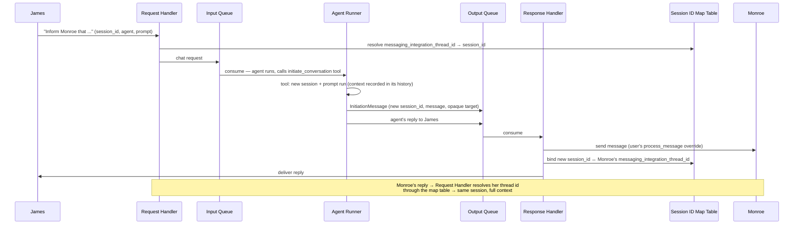

# AK-134: Agent-initiated conversations via messaging platforms

Agents gain the ability to open a conversation with a user on a messaging platform (Slack, WhatsApp, ...) such that the user's reply continues the same session instead of starting a context-less one. The design idea: the Agent Runner creates the session platform-blind, the Response Handler (the single send point) sends the message and binds the platform's `messaging_integration_thread_id` to the session in a shared Session ID Mapping table, and the Request Handler resolves replies through that table.

## Motivation

- Every messaging integration derives the session id solely from the inbound platform payload, so a reply to a proactively sent message resolves to a fresh, empty session:
  - Slack keys sessions on `thread_ts` (`ak-py/src/agentkernel/integration/slack/slack_chat.py:71`, `:125`)
  - WhatsApp keys on the sender's phone number (`ak-py/src/agentkernel/integration/whatsapp/whatsapp_chat.py:277`)
  - Telegram keys on the chat id (`ak-py/src/agentkernel/integration/telegram/telegram_chat.py:183`)
- No outbound-send surface exists outside a webhook reply context — sends are private methods of the integration handlers (e.g. `whatsapp_chat.py:305`), unusable for proactive messaging.
- In the queue pipeline there is no initiation path either:
  - the Request Handler requires a caller-supplied `session_id` (`ak-py/src/agentkernel/deployment/common/queue_request_handler.py:70`)
  - the Agent Runner only processes inbound chat requests (`ak-py/src/agentkernel/deployment/aws/containerized/akagentrunner.py:98`, `ak-py/src/agentkernel/deployment/aws/serverless/akagentrunner.py:120`)
  - the Response Handler only writes to the response store or broadcasts via WebSocket (`ak-py/src/agentkernel/deployment/aws/serverless/akresponsehandler.py:106-113`, `ak-py/src/agentkernel/deployment/aws/containerized/akoutputconsumer.py:55`)
- A production solution built on Agent Kernel hit this limitation: its agent sent a Slack message, and the user's reply started a context-less conversation. The current workaround — send the message, capture `thread_ts`, manually create the session in the session store and hand-write the user/agent exchange into it — must be replaced by a permanent, supported mechanism.

## Requirements

### Functional

- The feature must be agnostic to both the messaging integration and the agent framework in use.
  - No core or deployment component may import from or branch on a specific integration.
  - Core code never mutates framework-specific conversation history; the outbound context enters the new session through a normal agent run.
- The Agent Runner must have no knowledge of which messaging integration is used.
  - The recipient descriptor (`target`) is opaque to the runner; only the user's Response Handler override interprets it.
- Session creation for an agent-initiated conversation must happen inside the Agent Runner, before the `messaging_integration_thread_id` is known.
  - The thread id is obtained only later, when the Response Handler sends the message.
  - The new session must contain the outbound message as context, so the reply lands in a session where the agent knows what it sent — satisfied naturally: the message-generating agent run records the exchange in the framework's own history.
- Initiation is triggered from within an agent run via a tool (per the architecture diagram: an existing conversation asks the agent to inform another user; the tool creates the new session and emits the outbound message alongside the reply to the original requester).
  - The tool is the only trigger surface in this design (see Assumptions for schedulers/crons).
- The outbound message is **prompt-generated only**: the tool takes a prompt, the owning agent runs it inside the new session, and the agent's reply becomes the outbound message.
  - No fixed/verbatim message path — callers needing near-exact wording embed it in the prompt ("send this message exactly as written: ..."); verbatim output is not guaranteed.
  - This removes any need for lazy context injection (no seed records, no injection pre-hook) — the session's history is complete before the message is even sent.
- The Response Handler's existing overridable processing method (`QueueConsumer.process_message`, already the documented subclass-and-override extension point) is the special method for sending initiation messages — no new method is added.
  - Stock response handlers cannot deliver to messaging platforms today (they only write to the response store or broadcast via WebSocket), so platform delivery already lives in user overrides; initiation delivery joins it.
  - After a successful send, the override calls a provided completion API to create the mapping and initialize the AK thread.
- Messages must be sent to the user only from the Response Handler.
- If conversation thread support is enabled (`thread:` config block present, `ak-py/src/agentkernel/core/config.py:393`), an AK conversation thread must be created for the initiated conversation.
  - The thread's `user_id` is the message **recipient** (the user being contacted, e.g. Monroe) — not the initiating user.
  - No `group_id` is set.
  - The thread name comes from the configured naming strategy, derived from the outbound message; the strategy's built-in truncation fallback applies when no naming model is available.
- Agent selection for replies uses the existing request-based mechanism — the agent named in the request sent to the chat service, defaulting to the first registered agent when none is named.
  - No agent pin is persisted anywhere for initiated conversations.

### Deployment scope

- Queue-based deployments (AWS Lambda serverless, ECS containerized): the roles map onto the Request Handler, Agent Runner, and Response Handler components.
- Single-process REST deployments are also in scope: the integration handler fulfills both handler roles' contracts — it resolves inbound thread ids through the mapping table (overridable) and performs the send-and-bind step (overridable) in one process.

### Technical

- The `session_id ↔ messaging_integration_thread_id` association (`thread_ts` for Slack) must be maintained in a dedicated table — the **Session ID Mapping** table.
  - Used by both the Request Handler and the Response Handler; never touched by the Agent Runner.
  - The Request Handler reads the forward direction (thread id → session id) to route replies; the Response Handler reads the reverse direction (session id → thread id) when delivering later agent replies of an initiated conversation into the same platform thread.
  - The mapping store uses the same backend as the configured **session store** (follows the `session:` config `type`) — no separate backend selection.
  - The feature is gated by `AKConfig.conversation_initiation_enabled` (a `session.initiation:` config block, always present): explicit `session.initiation.enabled` wins, otherwise auto-enabled in queue-mode deployments (`execution.queues` configured), since only those register a dispatcher at startup — single-process REST needs the explicit opt-in. Store namespace (table/collection name or key prefix) and TTL are derived from the session store's own settings, not separately configured.
  - No config key selects the mapping store: `SessionStore.get_mapping_store()` is abstract, so a bring-your-own session store necessarily supplies its own mapping store, and a built-in one is paired by subclassing it and overriding that method.
  - The backing table is provisioned in Terraform under `ak-deployment/`, mirroring the existing response-store table pattern (`ak-deployment/ak-aws/containerized/dynamodb.tf:3`), with matching IAM grants.
- The Request Handler must resolve an incoming `messaging_integration_thread_id` to its `session_id` using this table, via a special method the user can override to customize the mapping logic.
  - When no mapping exists, it must fall back to the platform-derived session id (existing behavior, unchanged for reactive conversations).
- The Response Handler must create the mapping between a newly created session and its `messaging_integration_thread_id` if one does not already exist.
  - The mapping is written only after a successful send, by the user's `process_message` override calling the provided completion API (one call: bind mapping + initialize thread).
  - Stock (un-overridden) response handlers must never write initiation messages to the response store or broadcast them; they log a warning and drop.
- The Response Handler must also initialize the AK conversation thread for the initiated session when thread support is enabled (part of the same completion API call).
  - Thread creation requires a `user_id` (`ak-py/src/agentkernel/core/chat_service.py:503`, `ConversationThreadManager.get_or_create_thread`, `ak-py/src/agentkernel/core/thread/manager.py:115`); the recipient's identifier is used (see Functional requirements).

## Architecture

Flow: James asks the agent to inform Monroe → the Runner's tool creates a new session with the outbound context → the Output Queue carries both the agent's reply to James and the initiation message (with the new `session_id`) → the Response Handler sends to Monroe and writes the new `session_id ↔ thread_id` mapping → when Monroe replies, the Request Handler resolves the thread id through the Session ID Map table.

## Assumptions

- The conversation started by the agent (with Monroe) has no dependency on the originating conversation (James') reaching completion — the two sessions proceed independently once initiated.
- Scheduler- or cron-triggered initiation (application code opening a conversation without a surrounding agent run) is not considered in this design; it will be handled later.

## Non-goals

- No scheduler/cron trigger surface — the agent tool is the only trigger (see Assumptions).
- No fixed/verbatim outbound message path — the outbound text is always agent-generated from a prompt.
- No REST/API endpoint for external systems to trigger initiation (future work).
- No changes to how reactive (user-first) conversations derive their session ids.
- No rich outbound content (blocks, cards, templates) — plain text only.
- No workarounds for platform messaging policies (e.g. WhatsApp 24-hour window, template requirements); platform errors surface to the Response Handler.
- No persisted agent pinning — reply-side agent selection stays request-based (existing behavior).

## Open questions

- None — the initial set (thread ownership and naming, message source, trigger surfaces, mapping-store backend, deployment scope, agent pinning) was resolved in review and folded into the requirements above.
