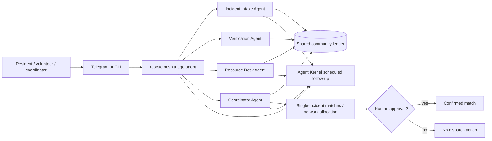

# RescueMesh

**Trust-aware, human-in-the-loop disaster coordination over the messaging channels people already use.**

RescueMesh turns noisy community messages into a privacy-aware incident ledger, merges likely duplicate reports, records verification, proposes resource matches, and keeps the final dispatch decision with a human coordinator. It is built as a multi-agent Agent Kernel use case with Telegram, session memory, tools, handoffs, REST/queue execution, scheduled follow-ups, and a no-key command center that can allocate scarce community resources across multiple incidents at once.

## 1. Problem statement

During floods, landslides, storms, fires, and other local emergencies, useful information often arrives through chat groups in an unstructured form: "five people are trapped", "we have a boat", "this road is blocked", "the same family was already reported", or "can someone bring drinking water?" Coordinators then have to manually deduplicate messages, judge which reports have been verified, find compatible resources, protect private contact information, and repeatedly follow up.

The result is **coordination overload**. Duplicate reports can make one incident appear larger than it is, genuine needs can be buried, donor offers can go unused, and private phone numbers or fine-grained locations can be copied into public groups.

RescueMesh addresses this as decision support rather than autonomous emergency dispatch. Its deterministic tools expose why a report received a priority band, and a resource match remains only a proposal until a human explicitly confirms it.

### Sustainable Development Goals

- **SDG 3 — Good Health and Well-being:** faster coordination for medical, rescue, water, and shelter needs.
- **SDG 11 — Sustainable Cities and Communities:** strengthens community resilience and local emergency coordination.
- **SDG 13 — Climate Action:** supports response to climate-amplified floods, storms, and related hazards.
- **SDG 17 — Partnerships for the Goals:** connects residents, volunteers, clubs, NGOs, and relief desks through a shared workflow.

## 2. Solution overview

A user can message the `rescuemesh` agent through Agent Kernel CLI or Telegram. The public-facing triage agent hands the conversation to specialist agents:



### What is intentionally innovative

1. **Trust-aware incident ingestion.** New reports are compared with active incidents using location/need similarity. A likely duplicate is merged and counted instead of creating another competing incident.
2. **Transparent triage rather than opaque ranking.** Severity, people count, vulnerable groups, and need types produce a deterministic score and visible reasons. The score is explicitly a human-review aid.
3. **Verification is a first-class workflow.** Eyewitness, trusted-volunteer, media, or official-source verification can be attached to an incident without pretending that every social message is true.
4. **Resource matching is reversible and human-gated.** Boats, vehicles, water, food, shelter, medical supplies, and other offers are ranked against incident needs, area, availability, and quantity. No resource is reserved until a named human reviewer confirms the pairing.
5. **Scarce resources are coordinated as a network, not one chat at a time.** `network_allocation_plan` considers every active incident together, prevents the same scarce boat/ambulance from being proposed twice, rewards urgency and verification, and adds a first-coverage fairness bonus so one incident does not silently consume every compatible resource. It is always a dry run.
6. **Privacy by construction.** Private incident records may contain a voluntary contact, while `public_incident_brief` strips contacts and coarsens fine-grained location data before a brief is shared to a public group.
7. **Follow-up is part of the agent lifecycle.** The coordinator can use Agent Kernel's scheduled-task capability to arrange future check-ins instead of relying on a person to remember every unresolved case.
8. **Cross-session community coordination.** Operational incidents/resources are shared across users in the running service, while Agent Kernel session memory remembers each user's current incident/resource/area for conversational continuity.
9. **Works even for a judge without an LLM key.** `command_center.py` provides a visual 60-second judge scenario and `demo_scenario.py` provides a terminal scenario. Both exercise the real deterministic coordination tools without an OpenAI key.
10. **Operational state can survive a restart without extra infrastructure.** The core remains zero-config/in-memory by default, while `RESCUEMESH_LEDGER_PATH` enables atomic JSON persistence for local command-center or bot deployments. Agent Kernel session memory remains separate per user.
11. **The field edge is offline-first.** The optional native Android **Field Relay** stores incident/resource submissions in an on-device outbox before network delivery. When connectivity returns, it retries against Agent Kernel REST using caller-generated idempotency keys, so intermittent networks do not create duplicate incidents or resource offers.

### Meaningful Agent Kernel usage

| Agent Kernel capability | RescueMesh usage |
| --- | --- |
| Multi-agent handoffs | Triage routes to intake, verification, resource-desk, and coordinator specialists. |
| Tool binding | Native tools implement reporting, verification, inventory, single-incident matching, network-wide allocation, status, privacy briefs, and metrics. |
| Session state | Agent Kernel non-volatile session cache remembers each user's active incident/resource/area, while a shared community ledger lets different chat sessions coordinate against the same incidents and resources. The ledger can optionally persist atomically to JSON. |
| Telegram integration | `telegram_server.py` mounts `AgentTelegramRequestHandler`; users interact through a real messaging platform. |
| REST/queue pipeline | `api_server.py` runs Agent Kernel `IOHandler`; `command_center.py` mounts the judge Command Center and Android field-ingest endpoints into Agent Kernel `RESTAPI`. |
| Scheduled tasks | `config.schedule.yaml` enables Agent Kernel's local scheduler and the coordinator's injected scheduling tools. |
| Framework adapter | Agents use OpenAI Agents SDK through `OpenAIModule` and `OpenAIToolBuilder`. |

### Competition scoring fit

| Published criterion | Evidence in this submission |
| --- | --- |
| **Idea / Use Case Value — 40%** | Real coordination bottleneck; trust-aware deduplication; verification; privacy-safe sharing; human-gated matching; scarce-resource network allocation; four SDGs. |
| **Agent Kernel Usage — 30%** | Five-agent handoff topology, Agent Kernel tool binding, session state, Telegram, queue pipeline, and injected scheduled-task tools. |
| **End Product / Working Solution — 20%** | No-key visual Command Center + terminal demo, installable offline-first Android field app, tested Docker deployment, automated tests, CLI, Telegram, and REST/scheduling server. |
| **Documentation / Submission Quality — 10%** | The four required README sections plus `EVALUATION.md`, `SPEC.md`, `AGENTS.md`, `ARCHITECTURE.md`, mobile guide, setup commands, and safety boundaries. |

### Judge shortcut

For a rubric-to-evidence map and the shortest verification path, see [`EVALUATION.md`](EVALUATION.md).

### Safety and responsibility boundary

RescueMesh is **not an emergency number and not an autonomous dispatcher**. It never claims a real-world response has occurred merely because an LLM suggested one. `match_resources` returns proposals only; `confirm_match` requires an explicit reviewer. In immediate danger, the agent instructions tell the user to contact the relevant local emergency authority while RescueMesh continues the coordination workflow.

## 3. Setup instructions

### Prerequisites

- Python **3.12–3.13.x**
- `uv`
- An OpenAI API key only for conversational agent runs
- Telegram bot credentials only for the Telegram integration

From this folder:

```bash
uv sync --python 3.12
```

This installs Agent Kernel with the `api`, `cli`, `cron`, `openai`, and `telegram` extras plus test tooling.

If Docker is available, the judge Command Center can instead be launched without installing Python dependencies on the host:

```bash
docker compose up --build
```

The container runs as a non-root user and persists the operational ledger in a named `/data` volume.

### Optional environment variables

For interactive OpenAI-backed agents:

```bash
export OPENAI_API_KEY="sk-..."
```

For Telegram:

```bash
export AK_TELEGRAM__BOT_TOKEN="<telegram-bot-token>"
export AK_TELEGRAM__WEBHOOK_SECRET="<random-webhook-secret>"
```

Do not commit credentials. `.env` is gitignored.

## 4. How to run the solution

### A. Fastest judge path — visual command center, no LLM key

```bash
uv run python command_center.py
```

Open **http://localhost:8000/rescuemesh** and click **Load 60-second scenario**. The page creates three concurrent incidents and six community resources, shows one duplicate being merged, distinguishes verified from unverified reports, calculates transparent P1/P2 priorities, and runs the network-wide dry-run allocator. Every proposed allocation has an explicit **Human confirm** gate.

The command center uses Agent Kernel `RESTAPI` and the same deterministic tools as the agents. Its operational ledger defaults to `.rescuemesh/ledger.json`, so a local judge session survives a restart without requiring a database. The file is gitignored.

The header also exposes **Android field relay**. The bundled APK can be downloaded directly from the running judge server at `http://localhost:8000/rescuemesh/mobile.apk`.

**Container alternative:** `docker compose up --build` exposes the exact same Command Center on port `8000`; this path was built and smoke-tested against `/health`, the seeded scenario, field-idempotency endpoints, and APK download.

### B. Android Field Relay — offline-first resident/volunteer surface

An installable APK is included at `mobile/releases/rescuemesh-field-relay-1.0.0.apk`. Start the Command Center first, install the app, and point it to the laptop's port `8000`. The app writes reports to an on-device outbox first, so you can disable connectivity, submit an incident/resource, reconnect, and synchronize later without duplicate retries. See [`mobile/README.md`](mobile/README.md) for the 90-second phone demo and build instructions.

### C. Terminal judge path — deterministic end-to-end scenario, no LLM key

```bash
uv run python demo_scenario.py
```

The scenario demonstrates incident intake, duplicate merging, verification, resource registration, ranked matching, explicit human confirmation, a privacy-safe public brief, and operational metrics.

### D. Run the real multi-agent CLI

```bash
export OPENAI_API_KEY="sk-..."
uv run python demo.py
```

Useful prompts:

```text
There are 6 people trapped by floodwater near Katubedda and they need a boat and drinking water. Two are children.
```

```text
I can provide one boat from Katubedda in 20 minutes.
```

```text
Show the best resource matches for incident INC-XXXXXXXX, but do not confirm anything yet.
```

```text
Create a privacy-safe public brief for INC-XXXXXXXX.
```

### E. Run through Telegram

```bash
export OPENAI_API_KEY="sk-..."
export AK_TELEGRAM__BOT_TOKEN="<token>"
export AK_TELEGRAM__WEBHOOK_SECRET="<secret>"
uv run python telegram_server.py
```

The Agent Kernel Telegram handler exposes the webhook endpoint at `/telegram/webhook`. Point the bot webhook to the public URL of that endpoint and use the same webhook secret.

### F. Run Agent Kernel scheduling + REST pipeline

```bash
export OPENAI_API_KEY="sk-..."
uv run python api_server.py
```

`api_server.py` switches Agent Kernel to `config.schedule.yaml`, which enables the local scheduled-task provider, in-memory schedule store, in-memory queue transport, and schedule-management handler.

Example one-time follow-up request:

```bash
curl -X POST http://localhost:8000/api/v1/chat \
  -H "Content-Type: application/json" \
  -d '{
    "prompt": "Check whether incident INC-XXXXXXXX is still unresolved and summarize the next coordination action.",
    "session_id": "incident-followup-1",
    "user_id": "coordinator-demo",
    "agent": "rescuemesh_coordinator",
    "schedule": {
      "at": "2030-01-31T09:00:00",
      "timezone": "Asia/Colombo",
      "session_mode": "reuse"
    }
  }'
```

### Tests

```bash
uv run pytest
```

The tests cover priority transparency, duplicate merging, privacy-safe briefs, verification, match proposal semantics, network allocation uniqueness/fairness behavior, optional durable-ledger recovery, human confirmation, Agent Kernel wiring, and operational metrics.

## Project layout

```text
rescuemesh/
├── README.md                 # competition-facing documentation
├── SPEC.md                   # coding-agent-readable product specification
├── AGENTS.md                 # implementation guardrails for coding agents
├── ARCHITECTURE.md           # technical architecture and design rationale
├── agent.py                  # five OpenAI/Agent Kernel agents + handoffs
├── tools.py                  # deterministic incident/resource coordination tools
├── demo.py                   # Agent Kernel CLI entry point
├── demo_scenario.py          # no-key deterministic terminal judge demo
├── command_center.py         # Agent Kernel REST judge dashboard + demo API
├── command_center.html       # responsive no-key operations UI
├── mobile/                   # Android Field Relay source, docs, and installable APK
├── telegram_server.py        # Agent Kernel Telegram integration
├── api_server.py             # queue pipeline + scheduled-task management
├── config.yaml               # CLI/Telegram session + integration config
├── config.schedule.yaml      # local scheduling + queue config
├── config.command-center.yaml # Agent Kernel REST config for the judge UI
├── Dockerfile / docker-compose.yml # no-key containerized judge deployment
├── Makefile                   # one-command setup/lint/test/demo helpers
├── pyproject.toml
└── tests/                     # deterministic domain + agent-wiring tests
```

## Why this is not a basic sample implementation

The included waste-sorting example is a useful single-agent demonstration. RescueMesh intentionally exercises a broader production-style slice of Agent Kernel: multiple specialist agents, explicit handoffs, stateful tools, a real messaging integration, privacy-safe publication, deterministic trust/dedup logic, network-wide scarce-resource planning, human-gated actions, a visual Agent Kernel REST command center, an offline-first Android field edge, operational metrics, queue execution, and scheduled follow-up. The domain logic remains testable without external services so judges can verify the core behavior quickly.
